# 1. Trusted Secure Enclaves Sensitive Edition (TSE-SE) Reference Architecture

## 1.1. Purpose of Document

This document is intended to outline the technical measures that are delivered by the _Trusted Secure Enclaves Sensitive Edition Reference Architecture_. This includes a summary of the major architectural decisions.

## 1.2. Table of Contents

- [1. Trusted Secure Enclaves Sensitive Edition (TSE-SE) Reference Architecture](#1-trusted-secure-enclaves-sensitive-edition-tse-se-reference-architecture)
  - [1.1. Purpose of Document](#11-purpose-of-document)
  - [1.2. Table of Contents](#12-table-of-contents)
- [2. Overview](#2-overview)
  - [2.1. Design Principles](#21-design-principles)
  - [2.2. Architecture Summary](#22-architecture-summary)
  - [2.3. Relationship to other AWS reference architectures](#23-relationship-to-other-aws-reference-architectures)
  - [2.4. Document Conventions](#24-document-conventions)
- [3. Account Structure](#3-account-structure)
  - [3.1. Overview](#31-overview)
  - [3.2. Organization structure](#32-organization-structure)
    - [3.2.1. Organization Management (root) AWS Account](#321-organization-management-root-aws-account)
    - [3.2.2. AWS SSO](#322-aws-sso)
  - [3.3. Organizational Units](#33-organizational-units)
    - [3.3.1. Security OU](#331-security-ou)
    - [3.3.2. Infrastructure OU](#332-infrastructure-ou)
    - [3.3.3. Functional OUs](#333-functional-ous)
    - [3.3.4. Functional OU: Sandbox](#334-functional-ou-sandbox)
    - [3.3.5. Functional OU: Dev](#335-functional-ou-dev)
    - [3.3.6. Functional OU: Test](#336-functional-ou-test)
    - [3.3.7. Functional OU: Prod](#337-functional-ou-prod)
    - [3.3.8. Central OU](#338-central-ou)
    - [3.3.9. Functional OU: UnClass (Optional)](#339-functional-ou-unclass-optional)
    - [3.3.10. Suspended OU](#3310-suspended-ou)
  - [3.4. Mandatory (Core) Accounts](#34-mandatory-core-accounts)
    - [3.4.1. Organization Management (root)](#341-organization-management-root)
    - [3.4.2. Perimeter Security](#342-perimeter-security)
    - [3.4.3. Shared Network](#343-shared-network)
    - [3.4.4. Operations (or alternatively called Shared Services)](#344-operations-or-alternatively-called-shared-services)
    - [3.4.5. Log Archive](#345-log-archive)
    - [3.4.6. Security Tooling](#346-security-tooling)
    - [3.4.7. DevOps account and/or Shared Team/Application (Optional)](#347-devops-account-andor-shared-teamapplication-optional)
    - [3.4.8. End User or Desktop (Optional)](#348-end-user-or-desktop-optional)
  - [3.5. Functional (Workload) Accounts](#35-functional-workload-accounts)
  - [3.6. Account Level Security Settings](#36-account-level-security-settings)
  - [3.7. Private Marketplace](#37-private-marketplace)
- [4. Authorization and Authentication](#4-authorization-and-authentication)
  - [4.1. Overview](#41-overview)
  - [4.2. Relationship to the Organization Management (root) AWS Account](#42-relationship-to-the-organization-management-root-aws-account)
  - [4.3. Break Glass Accounts](#43-break-glass-accounts)
  - [4.4. Multi-Factor Authentication](#44-multi-factor-authentication)
  - [4.5. Control Plane Access via AWS IdC](#45-control-plane-access-via-aws-idc)
    - [4.5.1. IdC User Roles](#451-idc-user-roles)
    - [4.5.2. Principal Authorization](#452-principal-authorization)
  - [4.6. Root Authorization](#46-root-authorization)
  - [4.7. Service Roles](#47-service-roles)
  - [4.8. Service Control Policies](#48-service-control-policies)
    - [4.8.1. Guardrail Protection (Parts 0 and 1)](#481-guardrail-protection-parts-0-and-1)
    - [4.8.2. Sensitive policy](#482-sensitive-policy)
    - [4.8.3. Unclassified policy](#483-unclassified-policy)
    - [4.8.4. Sandbox policy](#484-sandbox-policy)
    - [4.8.5. Quarantine New Object policy](#485-quarantine-new-object-policy)
- [5. Logging and Monitoring](#5-logging-and-monitoring)
  - [5.1. Overview](#51-overview)
  - [5.2. CloudTrail](#52-cloudtrail)
  - [5.3. VPC Flow Logs](#53-vpc-flow-logs)
  - [5.4. GuardDuty](#54-guardduty)
  - [5.5. Config](#55-config)
  - [5.6. CloudWatch Logs](#56-cloudwatch-logs)
    - [5.6.1. CloudWatch Logs Friction](#561-cloudwatch-logs-friction)
  - [5.7. SecurityHub](#57-securityhub)
  - [5.8. Systems Manager Session Manager and Fleet Manager](#58-systems-manager-session-manager-and-fleet-manager)
  - [5.9. Systems Manager Inventory](#59-systems-manager-inventory)
  - [5.10. Other Services](#510-other-services)
- [6. Networking](#6-networking)
  - [6.1. IP Address Management](#61-ip-address-management)
  - [6.2. Perimeter](#62-perimeter)
  - [6.3. Shared Network](#63-shared-network)
    - [6.3.1. Transit Gateway](#631-transit-gateway)
    - [6.3.2. Endpoint VPC](#632-endpoint-vpc)
    - [6.3.3. Endpoint VPC: DNS](#633-endpoint-vpc-dns)
    - [6.3.4. Endpoint VPC: Hybrid DNS](#634-endpoint-vpc-hybrid-dns)
    - [6.3.5. Workload VPCs](#635-workload-vpcs)
    - [6.3.6. Central VPC](#636-central-vpc)
    - [6.3.7. Sandbox VPC](#637-sandbox-vpc)
  - [6.4. Hybrid Connectivity and Inspection](#64-hybrid-connectivity-and-inspection)
    - [6.4.1. Connecting on-premises networks/datacenters to AWS tenancy](#641-connecting-on-premises-networksdatacenters-to-aws-tenancy)
    - [6.4.2. Workload account IaaS flow pattern](#642-workload-account-iaas-flow-pattern)
    - [6.4.3. CloudFront and API Gateway flow patterns](#643-cloudfront-and-api-gateway-flow-patterns)

# 2. Overview

National security, defence, and national law enforcement organizations around the world need the scale, global footprint, agility, and services that cloud brings to their critical missions—all while they are required to meet stringent security and compliance requirements for their data. Increasingly, these organizations leverage the AWS global hyper-scale cloud to deliver their missions while keeping their sensitive data and workloads secure. To help you accelerate these sensitive missions in cloud, we developed Trusted Secure Enclaves for National Security, Defence and National Law Enforcement.

Trusted Secure Enclaves Sensitive Edition (TSE-SE) is an **AWS Solution** which **helps** customers’ build and maintain a secure environment in AWS for processing sensitive, protected and sovereign workloads, irrespective of regional compliance regime (e.g. [CCCS-Medium](https://www.cyber.gc.ca/en/guidance/guidance-security-categorization-cloud-based-services-itsp50103), [FedRAMP-Moderate](https://www.fedramp.gov/understanding-baselines-and-impact-levels/), [IRAP](https://www.cyber.gov.au/irap)). TSE-SE includes a prescriptive and opinionated **reference architecture** coupled with an **open source automation engine** (Landing Zone Accelerator on AWS) that accelerates the implementation and maintenance of a **customer’s technical security and sovereignty controls**. TSE-SE targets regulated, high compliance, and sovereignty customers looking to build a secure foundation in AWS commercial regions with a focus on global national security, policing, and defence customers.

This document is solely focused on the deployed or resulting reference architecture and does NOT talk about the tooling, mechanisms, or automation engine used to deploy the architecture. The [Landing Zone Accelerator](https://github.com/awslabs/landing-zone-accelerator-on-aws) (LZA) is one tool capable of deploying this architecture (along with many other architectures), but customers are free to choose whichever mechanism they deem appropriate to deploy it. Readers should refer to the [LZA documentation](https://docs.aws.amazon.com/solutions/latest/landing-zone-accelerator-on-aws/solution-overview.html) for references to the LZA automation engine's architecture, design, operation, and troubleshooting. If using the LZA automation engine, this document reflects the resulting architecture that is deployed when using the TSE-SE sample configuration files. Customers are free to choose any mechanism they deem appropriate to deploy the architecture, however, only deployments leveraging the LZA automation engine are considered TSE-SE.

The _Trusted Secure Enclaves Sensitive Edition (TSE-SE) Reference Architecture_ is the comprehensive, multi-account AWS cloud architecture targeting sensitive, protected and sovereign level workloads and underpins the TSE-SE solution. This architecture was designed in collaboration with our national security, defence, national law enforcement, and federal, provincial, and municipal government customers to accelerate compliance with their strict and unique security and compliance requirements. The TSE-SE Reference Architecture was designed to help customers address central identity and access management, governance, data security, comprehensive logging, and network design/segmentation in alignment with security frameworks such as [NIST 800-53](https://www.nist.gov/privacy-framework/nist-sp-800-53), [ITSG-33](https://www.cyber.gc.ca/en/guidance/it-security-risk-management-lifecycle-approach-itsg-33), [FedRAMP-Moderate](https://www.fedramp.gov/understanding-baselines-and-impact-levels/), [CCCS-Medium](https://www.cyber.gc.ca/en/guidance/guidance-security-categorization-cloud-based-services-itsp50103), [IRAP](https://www.cyber.gov.au/irap), and other [sensitive](https://www.canada.ca/en/government/system/digital-government/modern-emerging-technologies/cloud-services/government-canada-security-control-profile-cloud-based-it-services.html#toc4) or medium level security profiles.

## 2.1. Design Principles

The _Trusted Secure Enclaves Sensitive Edition (TSE-SE) Reference Architecture_ has been developed using the following design principles:

1. Deliver security outcomes aligned with a medium level security control profile;
2. Maximize agility, scalability, and availability, while minimizing cost;
3. Enable the full capabilities of the AWS cloud;
4. Remain open to supporting and incorporating the AWS pace of innovation and the latest technological capabilities;
5. Allow for seamless auto-scaling and provide unbounded bandwidth as bandwidth requirements increase (or decrease) based on actual customer load (a key aspect of the value proposition of cloud computing);
6. Architect for high availability: the design uses multiple AWS Availability Zones, such that the loss of one Availability Zone does not impact application availability;
7. Operate as least privilege: all principals in the accounts are intended to operate with the lowest-feasible permission set;
8. Help address customer data sovereignty concerns.

## 2.2. Architecture Summary

The central features of the _Trusted Secure Enclaves Sensitive Edition Architecture_ are as follows:

- **AWS Organization with multiple-accounts:** An [AWS Organization][aws_org] is an [account](https://docs.aws.amazon.com/organizations/latest/userguide/orgs_getting-started_concepts.html#account) management service that enables the grouping of multiple  separate AWS accounts that are controlled by a single customer entity. This provides consolidated billing, account grouping using organizational units, and facilitates the deployment of pan-organizational guardrails such as API logging with CloudTrail and preventative controls using AWS Service Control Policies (SCPs). Separate AWS accounts provide strong control-plane and data-plane isolation between workloads and/or environments, as if they were owned by different AWS customers. The solution provides a prescriptive AWS account structure, giving different accounts different security personas based on its grouping.

- **Preventative security controls:** Protect the architecture, prevent the disablement of guardrails, and block undesirable user behavior. These are implemented using AWS Service Control Policies ([SCPs][aws_scps]). SCPs provide a guardrail mechanism principally used to deny specific or entire categories of API operations at an AWS account, OU, or organization level. These can be used to ensure workloads are deployed only in prescribed regions, or deny access to specific AWS services. The solution provides prescriptive SCPs.

- **Encryption:** AWS Key Management Service (KMS) with customer-managed keys is used to encrypt data stored at rest using FIPS 140-2 validated encryption, whether in S3 buckets, EBS volumes, RDS databases, or other AWS services storing data. Data in-transit is protected using TLS 1.2 or higher encryption terminated on load balancers deployed in the Perimeter account or when accessing AWS services via the AWS service endpoints.

- **Centralized, isolated networking:** [AWS Virtual Private Clouds][aws_vpc] (VPCs) are used to create data-plane isolation between workloads, centralized in a shared-network account. Centralization enables strong segregation of duties and cost optimization. Connectivity to on-premises environments, internet egress, shared resources and AWS APIs are mediated at a central point of ingress/egress via the use of [Transit Gateway][aws_tgw], [Site-to-Site VPN][aws_vpn], Next-Gen Firewalls, and [AWS Direct Connect][aws_dc] (where applicable). The centralized VPC architecture is not for all customers; for customers less concerned with cost optimization, an option exists for local account based VPCs interconnected via the Transit Gateway in the central shared-network account. Under both options, the architecture prescribes moving AWS public API endpoints into the customer's private VPC address space, using centralized endpoints for cost efficiency.

- **Segmentation and Separation:** Not only does the architecture provide strong segmentation and separation between workloads belonging to different stages of the SDLC cycle, or between different IT administrative functions (like between networking, ingress/egress firewalls, and workloads), it offers a strong network zoning architecture, micro-segmenting the environment by wrapping every instance or component in a stateful firewall which is enforced in the hardware of the AWS EC2 system. All flows are tightly enforced, with lateral movement prevented between applications, tiers within an application, and nodes in a tier of an application unless explicitly allowed. Further, routing is prevented between Dev, Test, and Prod.   We additionally provide recommendations on a CI/CD process to enable code promotion between environments to ensure developer agility.

- **Centralized DNS management:** [Amazon Route 53][aws_r53] is used to provide unified public and private hosted zones across the cloud environment. Inbound and Outbound Route 53 Resolvers extend this unified view of DNS to on-premises networks.

- **Centralized logging:** The architecture prescribes comprehensive log collection and centralization across all AWS accounts within an Organization.
   - CloudTrail logs are enabled organization-wide to provide full control plane auditability across the cloud environment;
   - VPC flow logs are enabled to capture information about the traffic flows throughout your environment;
   - Route53 DNS Query Logs are enabled to capture DNS query behavior within the environment;
   - CloudWatch Logs, AWS's cloud native logging service is used to capture a wide variety of logs including OS and application logs, VPC flow logs, and DNS logs;
   - Logs are centralized and deletion is prevented using SCPs.


- **Centralized security monitoring:** Compliance drift and security threats are surfaced across the customer's AWS Organization via the automatic deployment of a multitude of different types of detective security controls. This includes enabling AWS security services in every account in the customers AWS organization including Amazon GuardDuty, AWS Security Hub, AWS Config, AWS Firewall Manager, Amazon Macie, Access Analyzer, CloudWatch Alarms with control and visibility delegated across the multi-account environment to a single central security tooling account for organization-wide visibility to all security findings and compliance drift. 

- **Single Sign-On**: AWS Identity Center (IdC) is used to provide centralized IAM role assumption into AWS accounts across the organization for authorized principals. An organization's existing identities can be sourced from a customer's existing Active Directory identity store or other 3rd party identity provider (IdP). AWS enables MFA enforcement using Authenticator apps, Security keys and built-in authenticators, supporting WebAuthn, FIDO2, and U2F based authentication and devices.

- **Centralized ingress/egress IaaS inspection:** It is common to see centralized ingress/egress requirements for IaaS based workloads. The architecture provides said functionality, enabling customers to decide if native AWS ingress/egress firewall inspection services meet their requirements, or to augment those capabilities with 3rd party firewall appliances. The architecture supports starting with an AWS firewall by default, and customers can opt to switch to a 3rd party firewall ([Fortinet example](../reference-artifacts/third-party/fortinet/README.md)), or a combination of ingress/egress firewall technologies.

- **Automation:** Automation is a critical component of the architecture. It ensures guardrails are consistently applied as new AWS accounts are added to the organization as new teams and workloads are brought onboard. It remediates compliance drift and provides guardrails in the root organization account.

The following diagram illustrates the TSE-SE reference architecture:

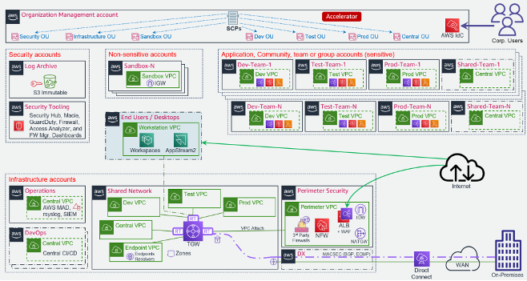

Note: components denoted using a long-dash-dot are optional components, not deployed by default as part of TSE-SE LZA configuration.
The following diagram illustrates an alternative TSE-SE reference architecture which uses spoke VPCs created from a VPC template (instead of centralized VPCs):

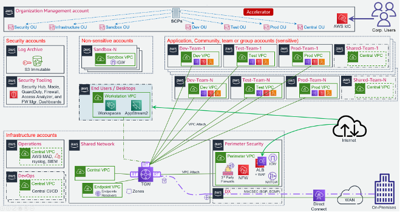

## 2.3. Relationship to other AWS reference architectures

The _Trusted Secure Enclaves Sensitive Edition Architecture_ builds upon AWS standardized design patterns and best practices while adding common public sector security requirements. The architecture aligns with AWS multi-account guidance, AWS Well-Architected Framework, and the AWS Security Reference Architecture (SRA).

## 2.4. Document Conventions

The following conventions are used throughout this document.

#### 2.4.0.1. AWS Account Numbers

AWS account numbers are decimal-digit pseudorandom identifiers with 12 digits (e.g. `651278770121`). This document will use the convention that an AWS Organization Management (root) account has the account ID `123456789012`, and child accounts are represented by `111111111111`, `222222222222`, etc.

For example the following ARN would refer to a VPC subnet in the `ca-central-1` region in the Organization Management (root) account:

    arn:aws:ec2:ca-central-1:123456789012:subnet/subnet-024759b61fc305ea3

#### 2.4.0.2. JSON Annotation

Throughout the document, JSON snippets may be annotated with comments (starting with `//`). The JSON language itself does not define comments as part of the specification; these must be removed prior to use in most situations, including the AWS Console and APIs.

For example:

```jsonc
{
  "Effect": "Allow",
  "Principal": {
    "AWS": "arn:aws:iam::123456789012:root" // Trust the Organization Management account
  },
  "Action": "sts:AssumeRole"
}
```

The above is not valid JSON without first removing the comment on the fourth line.

#### 2.4.0.3. IP Addresses

The design makes use of [RFC1918][1918] addresses (e.g. `10.1.0.0/16`) and [RFC6598][6598] (e.g. `100.96.250.0/23`) for various networks; these will be labeled accordingly. Any specific range or IP shown is purely for illustration purposes only.

#### 2.4.0.4. Customer Naming

This document will make no reference to specific AWS customers. Where naming is required (e.g. in domain names), this document will use a placeholder name as needed; e.g. `example.ca`.

# 3. Account Structure

## 3.1. Overview

AWS accounts provide a strong isolation boundary; by default there is no control plane or data plane access from one AWS account to another. AWS accounts provide different AWS customers an isolated private cloud tenancy inside the AWS commercial cloud. It is worth noting that users and roles reside within AWS accounts, and are the constructs used to grant permissions within an AWS account to people, services and applications. AWS Organizations is a service that provides centralized billing across a fleet of accounts, and optionally, some integration-points for cross-account guardrails and cross-account resource sharing. The _Trusted Secure Enclaves Sensitive Edition Architecture_ uses these features of AWS Organizations to realize its outcomes.

## 3.2. Organization structure

The _Trusted Secure Enclaves Sensitive Edition Architecture_ includes the following default AWS organization and account structure.

Note that the AWS account structure is strictly a control plane concept - nothing about this structure implies anything about the network architecture or network flows.

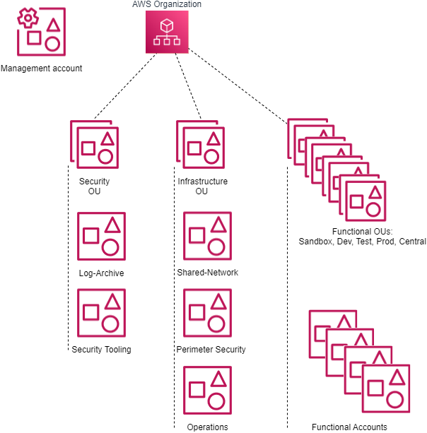

### 3.2.1. Organization Management (root) AWS Account

The AWS Organization resides in the Organization Management (root) AWS account and is traditionally an organization's first AWS account. This account is not used for workloads - it functions primarily as a billing aggregator, and a gateway to the entire cloud footprint for high-trust principals. Access to the Management account must be strictly controlled to a small set of highly trusted individuals from the organization. Additionally, the Organization Management account is where the automation engine or tooling is installed to automate the deployment of the TSE-SE architecture and its security guardrails. There exists a trust relationship which is used by the automation engine between child AWS accounts in the organization and the Organization Management (root) account; from the Management account, users and roles can assume a role of the following form in child accounts:

```json
{
  "Role": {
    "Path": "/",
    "RoleName": "OrganizationAccountAccessRole",
    "Arn": "arn:aws:iam::111111111111:role/OrganizationAccountAccessRole", // Child account*
    "AssumeRolePolicyDocument": {
      "Version": "2012-10-17",
      "Statement": [
        {
          "Effect": "Allow",
          "Principal": {
            "AWS": "arn:aws:iam::123456789012:root" // Organization Management account may assume this role
          },
          "Action": "sts:AssumeRole"
        }
      ]
    }
  }
}
```

Note: this is the default role installed by AWS Organizations (`OrganizationAccountAccessRole`) when new AWS accounts are created using AWS organizations.  
*This role changes to `AWSControlTowerExecution` when Control Tower is being leveraged.

### 3.2.2. AWS SSO

AWS Identity Center (IdC) resides in the Organization Management account. Once deployed within the Organization Management account AWS IdC administration is delegated to the Operations account (sometimes referred to as the Shared Services account). AWS IdC is where you create, or connect, your workforce identities in AWS, once, and manage access centrally across your AWS organization. You can create user identities directly in AWS IdC, or you can bring them from your Microsoft Active Directory (on-premises or an AWS Managed Active Directory)  or a standards-based identity provider, such as Okta Universal Directory or Azure AD. AWS IdC provides a unified administration experience to define, customize, and assign fine-grained access. Your workforce users get a user portal to access all of their assigned AWS accounts. The AWS IdC service deploys IAM roles into accounts in the organization and associates them with the designated workforce identities.  More details on IdC are available in the **Authentication and Authorization** section of this document.

## 3.3. Organizational Units

Underneath the root of the organization, Organizational Units (OUs) provide a mechanism for grouping accounts into logical collections. Aside from the benefit of the grouping itself, these collections serve as the attachment points for SCPs (preventative API-blocking controls), and Resource Access Manager sharing (cross-account resource sharing). 

The OU an AWS account is placed in determines the account's purpose, its security posture**, network architecture,** and the applicable guardrails, or described another way, it defines the accounts persona. An account placed in the Sandbox OU would have the least restrictive, most agile, and most cloud native functionality, whereas an account placed in the Prod OU would have the most restrictive set of guardrails applied.

OUs are NOT designed to reflect an organization's structure, and should instead reflect major shifts in permissions. OUs should not be created for every stage in the SDLC cycle, but those that represent a major permissions shift. For example, organizations that have multiple test stages would often locate the Test and QA Test instances of a workload within the same AWS test account. Customers with a Pre-Prod requirement would often either place their Pre-Prod workloads into their Prod account (alongside the Prod workloads), or in cases requiring more extensive isolation, in a second AWS account located in the Prod OU. 

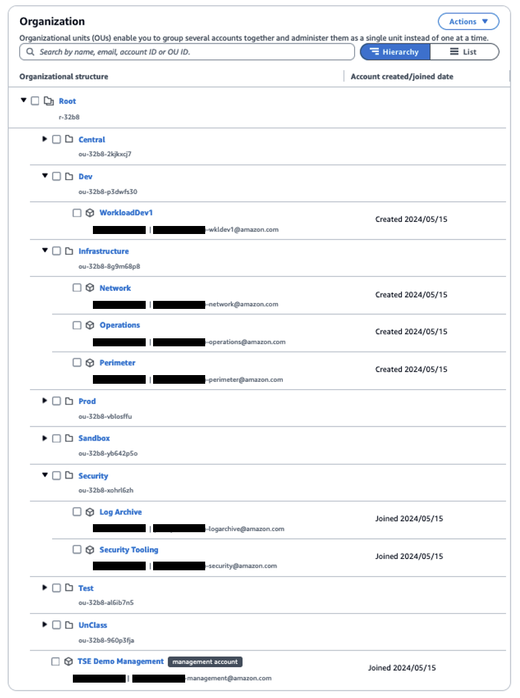

Example use cases are as follows:

- An SCP is attached to the Infrastructure OU to prevent the deletion of Transit Gateway resources in the associated accounts.
- •	The Shared Network account uses Resource Access Manager (RAM) sharing to share the development line-of-business VPC with accounts in the development OU. This makes the VPC available to a functional account in that OU used by developers, despite residing logically in the shared network account.

OUs may be nested (to a total depth of five), with SCPs and RAM sharing being controlled at the top level by the automation tooling. A typical _Trusted Secure Enclaves Sensitive Edition Architecture_ environment will have the following OUs:

### 3.3.1. Security OU

The accounts in this OU are considered administrative in nature with access often restricted to _IT security personnel_.

The Security OU is used to hold AWS accounts containing AWS security resources shared or utilized by the rest of the organization. The accounts in the security OU (Log Archive and Security Tooling) often represent the core or minimum viable set of accounts for organizations wishing to slim the architecture down. No application accounts or application workloads are intended to exist within this OU.

### 3.3.2. Infrastructure OU

The accounts in this OU are also considered administrative in nature with access often restricted to _IT operations personnel_.

The Infrastructure OU is used to hold AWS accounts containing AWS infrastructure resources shared or utilized by the rest of the organization. The accounts in the Infrastructure OU are also considered core accounts, including accounts like the centralized Shared Network account, the Perimeter Security centralized ingress/egress account, and the Operations account. No application accounts or application workloads are intended to exist within this OU.

The Infrastructure OU is used to hold AWS accounts containing AWS infrastructure resources shared or utilized by the rest of the organization. The accounts in the Infrastructure OU are also considered core accounts, including accounts like the centralized Shared Network account, the Perimeter centralized ingress/egress account, and the Operations account. No application accounts or application workloads are intended to exist within this OU.

### 3.3.3. Functional OUs

It is envisioned that most major applications, groups of workloads or teams will work across a set of three or four dedicated AWS accounts provisioned across different functional OUs (Dev, Test, Prod and optionally Central). As new teams, major applications or groups of workloads are onboarded to AWS, they will be provided with this group of new AWS accounts. New teams, groups of applications and major workloads do not share AWS accounts, they each get their own set of unique AWS accounts providing strong segregation and isolation both between stages in the SDLC cycle and between other workloads or teams.

### 3.3.4. Functional OU: Sandbox

Accounts in this OU are used by development and IT teams for proof of concept / prototyping work. The Sandbox OU offers the most cloud native, agile experience and is used for experimentation. It is not to be used to hold production workloads or sensitive data as it offers the fewest security controls.

These accounts are isolated at a network level and are not connected to any of the other accounts within the organization or to any of the VPCs hosting development, test, production, or shared workloads, nor do they have on-premises network connectivity. These accounts have direct internet access via an internet gateway (IGW). They do not route through the Perimeter Security services account or VPC for internet access. While the accounts in the Sandbox OU have a reduced set of security controls, these accounts still have guardrails applied, including the enablement of AWS security services and centralized logging.

### 3.3.5. Functional OU: Dev

The Dev OU is used to hold accounts at the Development or similarly permissioned stage of the SDLC cycle, often containing sensitive data and workloads.

This is the primary account type that an organization's developers would typically work within and hosts development tools and line of business application solutions that are in active development. External access for these accounts is provided via the Shared Network account and/or the Perimeter account.

### 3.3.6. Functional OU: Test

The Test OU is used to hold accounts at the test or similarly permissioned (i.e. QA) stage of the SDLC cycle and typically contain sensitive data and workloads. Accounts in this OU host testing tools and line of business application solutions that are being tested prior to promotion to production. External access for these accounts is provided via the Shared Network account and/or the Perimeter account. As test workloads can easily be destroyed and recreated between test cycles, and temporarily scaled on-demand during performance testing, accounts in the Test OU are generally small in comparison to their Dev and Prod counterparts.

### 3.3.7. Functional OU: Prod

The Prod OU is used to hold accounts at the Production or similarly permissioned (i.e. Pre-Prod) stage of the SDLC cycle containing sensitive unclassified data or workloads.

Accounts in this OU host production tools and production line of business application solutions. External access for these accounts is provided via the Shared Network account and/or the Perimeter account. Accounts in this OU are ideally locked down with only specific Operations and Security personnel having access.

### 3.3.8. Central OU

The Central OU is used to optionally hold AWS accounts which contain group or team resources used and shared across functional OUs (such as Active Directory and patch management servers) or SDLC boundaries like CI/CD or code promotion tools and software development tooling (source control, testing infrastructure, asset repositories). The architecture supports creating a single central CI/CD or DevOps account, a DevOps account per set of team or application accounts, or combinations in-between. The account structure can be customized to meet each organization's own code promotion and shared tooling requirements. External access for these accounts is provided via the Shared Network account and/or the Perimeter account.

### 3.3.9. Functional OU: UnClass (Optional)

Non-sensitive workloads should generally be placed with sensitive workloads (Dev/Test/Prod/Central OUs), gaining the extra security benefits of these environments. This OU is used when an organization needs to provide AWS console access to users (internal or external) without appropriate personnel vetting, to enable deploying and testing AWS services not approved for use with sensitive data, or when services are not available in the local AWS regions which support data locality and sovereignty requirements. These accounts are provided internet access for IaaS based workloads via the Perimeter account. Unless this specific use case applies, we generally discourage the use of this OU.

### 3.3.10. Suspended OU

A suspended OU is created to act as a container for end-of-life accounts which have been closed or suspended, as suspended accounts continue to appear in AWS organizations even after they have been closed and suspended. The `DenyAll` SCP is applied, which prevents all control-plane API operations from taking place by any account principal. Should a suspended account be unintentionally re-activated, no API operations can be performed without intervention of the cloud team.

## 3.4. Mandatory (Core) Accounts

The _Trusted Secure Enclaves Sensitive Edition Architecture_ is an opinionated architecture, which partly manifests in the accounts that are deemed mandatory within the organization. The following accounts are assumed to exist, and each has an important function with respect to the goals of the overall Architecture.

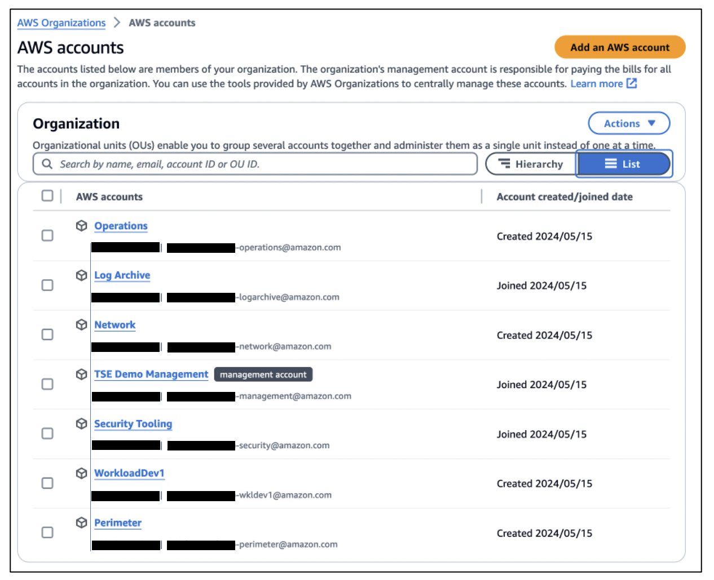

### 3.4.1. Organization Management (root)

This is the Organization Management or root AWS account. Access to this account must be highly restricted, and should not contain customer resources.

As discussed above, the Organization Management (root) account functions as the root of the AWS Organization, the billing aggregator, and attachment point for SCPs. Workloads are not intended to run in this account.

**Note:** Customers deploying the _Trusted Secure Enclaves Sensitive Edition Architecture_ via the [LZA automation engine][accel_tool] will deploy into this account.

### 3.4.2. Perimeter Security

This account is used for internet facing IaaS based ingress/egress security services. The perimeter account, and in particular the perimeter VPC therein, functions as the single point of IaaS based ingress/egress from the sensitive cloud environment to the public internet and, in some cases, on-premises networks. This provides a central point of network control through which internet bound workload-generated IaaS traffic, both ingress and egress, must transit. The perimeter VPC can host AWS and/or 3rd party next-generation firewalls that provide security services such as virus scanning, malware protection, intrusion protection, TLS inspection, and web application firewall functionality. More details can be found in the Networking section of this document.

### 3.4.3. Shared Network

This account is used for centralized or shared networking resources. The shared network account hosts the vast majority of the AWS-side of the networking resources throughout the _Trusted Secure Enclaves Sensitive Edition Architecture_. Workload-scoped VPCs (`Dev`, `Test`, `Prod`, etc.) are deployed in the Shared Network account, and shared via RAM sharing to the respective workload accounts based on their associated OUs. A Transit Gateway provides connectivity from the workloads to the internet or on-premises, without permitting cross-environment (AKA "East/West traffic") traffic (e.g. the Transit Gateway provides VRF like separation between the `Dev` VPC, the `Test` VPC, and the `Prod` VPC). More details can be found in the Networking section of this document.

### 3.4.4. Operations (or alternatively called Shared Services)

This account is used for centralized IT Operational resources (Active Directory, traditional syslog tooling, ITSM, etc.). The operations account provides a central location for the cloud team to provide cloud operation services to other AWS accounts across the organization and is where an organizations cloud operations team "hangs out" or delivers tooling applicable across all accounts in the organization. The Operations account has View-Only access to CloudWatch logs and metrics across the organization. It is where centralized Systems Manager Session Manager Automation (remediation) documents are located. It is where organizations centralize backup automation (if automated), SSM inventory and patch jobs are automated, and where AWS Managed Active Directory would typically be deployed and accessible to all workloads in the organization. In some AWS documentation this is referred to as the Shared Services account.

### 3.4.5. Log Archive

The Log archive account is used to centralize and store immutable logs for the organization. The Log Archive account provides a central aggregation and secure storage point for all audit logs created within the AWS Organization. This account contains a centralized storage location for copies of every account’s audit, configuration compliance, and operational logs. It also provides a storage location for any other audit/compliance logs, as well as application/OS logs.

As this account is used to provide long-term retention and immutable storage of logs, it is generally recommended nobody have access to this account. Logs should be auto-ingested into a SIEM-like solution as they are centralized into the Log Archive account for analysis and correlation by auditors and security teams. Direct access to the Log Archive account should be restricted to deep forensic analysis of logs by auditors and security teams during a forensic investigation. Local logs are made directly available for local use by teams working in any account on a shorter-term retention basis.

### 3.4.6. Security Tooling

This account is used to centralize access to AWS security tooling and consoles. The security account is restricted to authorized security and compliance personnel, and related security or audit tools. This is an aggregation point for security services, including AWS Security Hub, GuardDuty, Macie, Config, Firewall Manager, Detective, Inspector, and IAM Access Analyzer.

### 3.4.7. DevOps account and/or Shared Team/Application (Optional)

These accounts are used to deliver CI/CD capabilities or shared tooling - two patterns are depicted in the architecture diagram in section 1.2.2 of the Overview - The first has a single organization wide central CI/CD or shared tooling account (named the DevOps account), the other has a CI/CD and shared tooling account per major application team/grouping of teams/applications (named Shared-Team-N). Which pattern is used will depend entirely on the organization's size, maturity model, delegation model of the organization and their team structures. We still generally recommend CI/CD tooling in each developer account (i.e. using Code Commit). When designated branch names are leveraged, the branch/PR will automatically be pulled into the centralized CI/CD tooling account. After approval(s), the code will again be automatically pushed through the SDLC cycle to the Test and/or Prod accounts, as appropriate. Refer to [this](https://aws.amazon.com/blogs/devops/aws-building-a-secure-cross-account-continuous-delivery-pipeline/) blog for more details on automating this pattern.

### 3.4.8. End User or Desktop (Optional)

When an organization configures hybrid on-premises to cloud networking, end-users can directly access the cloud environment using their on-premises organization provided desktops or laptops. When hybrid access is not available, or to enable access from locations and devices whose posture may be not be fully assessed, users can access the organization’s cloud environment via virtualized desktops and/or virtual applications provisioned through the End User or Desktop account. The End User or Desktop account is used to provide your organization’s end-user community access to the applications running in the environment.

A dedicated Workstation VPC would be created within the End User account to hold the virtual desktops. Virtual desktops would be created within a security group that prevents and blocks all lateral movement or communications between virtual desktops.

Different pools of desktops would exist, with most users only being provisioned desktops which could access the front-end of production applications (or the web tier). Additional pools would be created that provide developers full access to their development environments.

## 3.5. Functional (Workload) Accounts

Functional or Workload accounts are created on demand, and placed into an appropriate OU in the organization structure. The purpose of functional accounts is to provide a secure and managed environment where project teams can use AWS resources. They provide an isolated control plane so that the actions of one team in one account cannot inadvertently affect the work of other teams in other accounts.

Functional/Workload accounts will gain access to the RAM shared resources based on their respective parent OU. Accounts created for `systemA` and `systemB` in the `Dev` OU would have control plane isolation from each other and therefore be unable to see each others resources; however these would both have access to the `Dev` VPC (shared from the `Shared Network` account).

Data plane isolation within the same VPC is achieved by default, by using appropriate security groups whenever ingress is warranted. For example, the app tier of `systemA` should only permit ingress from the `systemA-web` security group, not an overly broad range such as `0.0.0.0/0`, or even the entire VPCs address range.

## 3.6. Account Level Security Settings

The _Trusted Secure Enclaves Sensitive Edition Architecture_ enables certain account-wide features on account creation. Namely, these include:

1. [S3 Public Access Block][s3-block]
2. [Default encryption of EBS volumes][ebs-encryption] using a customer managed local account KMS key

## 3.7. Private Marketplace

The _Trusted Secure Enclaves Sensitive Edition Architecture_ enables the AWS Private Marketplace for the organization as part of the TSE-SE installation process. Private Marketplace allows administrators to govern which products they want their users to run on AWS by making it possible to see only products that have been allow-listed by the organization based on compliance with an organization's security and procurement policies. When Private Marketplace is enabled, it will replace the standard AWS Marketplace for all users, with the new custom branded and curated Private Marketplace.


# 4. Authorization and Authentication

## 4.1. Overview

The _Trusted Secure Enclaves Sensitive Edition Architecture_ makes extensive use of AWS authorization and authentication primitives from the Identity and Access Management (IAM) service as a means to enforce the guardrail objectives of the Trusted Secure Enclaves Sensitive Edition Architecture, and govern access to the set of accounts that makes up the organization.

## 4.2. Relationship to the Organization Management (root) AWS Account

AWS accounts, as a default position, are entirely self-contained with respect to IAM principals - their Users, Roles, Groups are independent and scoped only to themselves. Accounts created by AWS Organizations deploy a default role with a trust policy back to the Organization Management account. While it can be customized, by default this role is named the `OrganizationAccountAccessRole` (or `AWSControlTowerExecution` when Control Tower is deployed).

As discussed, the AWS Organization resides in the Organization Management (root) account. This account is not used for workloads and is primarily a gateway to the entire cloud footprint for a high-trust principal. It is therefore crucial that all Organization Management account credentials be handled with extreme diligence, and with a U2F hardware key enabled as a second-factor (and stored in a secure location such as a safe) for all users created within this account, including the root user, regardless of privilege level assigned directly within the Management account.

## 4.3. Break Glass Accounts

The Organization Management account is used to provide break glass access to AWS accounts within the organization. Break glass (which draws its name from breaking the glass to pull a fire alarm) refers to a quick means for a person who does not have access privileges to certain AWS accounts to gain access in exceptional circumstances, using an approved process. Access to AWS accounts within the organization is provided through AWS IdC. The use and creation of IAM users is highly discouraged, with one exception, break glass users. It is generally recommended that organizations create between 2 to 4 IAM break glass users within the Organization Management account. These users would have hardware based MFA enabled and would be leveraged in exceptional circumstances to gain access to the Organization Management account or sub-accounts within the organization by assuming a role. Use cases for break glass access include failure of the organizations IdP, an incident involving the organizations IdP, a failure of AWS IdC, or a disaster involving the loss of an organization’s entire cloud or IdP teams.

To re-iterate, access to the Organization Management account grants ‘super admin’ status, given the organizational-wide trust relationship to the management account. Therefore access to the 2 to 4 break glass IAM users must be tightly controlled, yet accessible via a predefined and strict process. This process often involves one trusted individual having access to a safe containing the password and a different trusted individual having access to a safe with the hardware MFA key – requiring 2 people to access the break glass credentials.

It is worth noting that AWS SCPs are not applicable to the Organization Management account. It is also worth noting that from within the Organization Management account, roles can be assumed in any account within the organization which include broad exclusions from the SCPs (discussed below). These roles are needed to allow the automation tooling to apply and update the guardrails as required, to troubleshoot and resolve issues with the automation tooling, and to bypass the guardrails under approved exception scenarios.

Several roles are available for access across the organization from the Management account: the LZA tooling roles which are excluded from the majority of the SCPs to enable the automation tooling to deploy, manage and update the guardrails and provide access to troubleshoot and resolve issues with the automation tooling; and the standard OrganizationAccountAccessRole which has been only been excluded from SCPs which strictly deliver preventative security controls. The OrganizationAccountAccessRole is within the bounds of the SCPs which protect automation tooling deployed guardrails and functionality. Access to these roles is available to any IAM user or role in the Organization Management account.

## 4.4. Multi-Factor Authentication

Multi-factor authentication (MFA) is an industry best practice and a critical security control as it is deemed to block over 99% of account compromises. MFA adds extra security that requires users to provide unique authentication from an AWS supported MFA mechanism in addition to their sign-in credentials when they access AWS websites or services. **_TSE-SE prescribes the use of MFA for all users regardless of privilege level._** Important considerations when selecting an approach to MFA:

- The use of phishing resistant MFA is strongly encouraged with the industry standardizing on technologies based on FIDO standards, like FIDO2 authenticators which are supported by both AWS IAM and Identity Center;
- SMS text messages and email based one-time tokens are generally considered a weak form of MFA based authentication and no longer supported by AWS;
- Breakglass access typically mandates credentials be stored in a secure storage location (e.g. a safe) for long periods of time, introducing considerations around device battery life and tightly restricting access, making virtual authenticator apps and FIDO2 synced passkeys inappropriate.  FIDO2 security keys are recommended for these use cases as they are a physical MFA device, have no battery requirements, are phishing resistant, and support multiple users on a single device;
- Hardware TOTP tokens (e.g. RSA token) are a strong form of hardware based MFA authentication but can only be assigned on a 1:1 basis, are not phishing resistant, and utilize a battery. A unique token is required for every user in every account. You cannot utilize the same token for multiple users or across AWS accounts. With Hardware TOTP tokens, users authenticate by typing a time-based code generated by the token during sign-in. While TOTP tokens are supported by IAM, they are not supported by Identity Center.
- Virtual authenticator apps (e.g. Google Authenticator on a mobile device) are generally considered a good software based MFA mechanism, but are not phishing resistant, require batteries, and not considered as strong as hardware TOTP tokens or FIDO2 authenticators. With virtual authenticators. users authenticate by typing a time-based code generated by an app installed on their mobile device or computer when prompted during sign-in. Virtual MFA is not suitable for break glass type scenarios but a good option while waiting for FIDO2 compatible hardware acquisitions to complete;
- FIDO2 authenticators, two types exist, device-bound passkeys (called security keys) and synced passkeys (often called passkeys), both supported by AWS IAM and Identity Center.
   - Security keys (e.g. Yubikey or Feitian key) are typically a stronger form of security because the key material can’t be copied or shared and are bound to a specific piece of hardware connected to your device through USB, BLE, or NFC.  Security keys have no battery requirements, are phishing resistant, and support multiple users on a single device.
   - Passkey - Authenticates using your fingerprint, face, or screen lock using a built-in authenticator in many modern computers and mobile phones, or accessed via a credential manager from providers such as Google, Apple, Microsoft accounts, and third-party services like 1Password, and Bitwarden as a second factor.  With synced passkeys the key material is saved to a remote fabric, so it can be restored on any other devices owned by the same user. While not as strong as security keys, it is phishing resistant and offers a simpler user experience by enabling users access from any of their devices.

Additional guidelines to the application of MFA in AWS:


- Hardware based phishing resistant MFA devices, like Yubikeys, provide the strongest form of MFA protection and are strongly encouraged for all account root users and all IAM users in the Organization Management (root) account;
- the Organization Management (root) account requires a dedicated hardware MFA, such that when access is required to a sub-account root user, you do not expose the Organization Management account’s MFA device;
- each IAM break glass user requires a dedicated hardware MFA device, as do any additional IAM users in the Organization Management (root) account. While some CSPs do not recommend MFA on the break glass users, it is strongly encouraged in AWS;
- the MFA devices for all account root users including the management account and the IAM break glass users should be securely stored, with well-defined access policies and procedures;
- all other AWS users (AWS IdC, IAM in sub-accounts, etc.) regardless of privilege level should leverage security keys, passkeys, or virtual MFA devices (like Google Authenticator on a mobile device).

## 4.5. Control Plane Access via AWS IdC

The vast majority of end-users of the AWS cloud within the organization will never use or interact with the Organization Management account, or the root users of any child account in the organization. The _Trusted Secure Enclaves Sensitive Edition Architecture_ recommends instead that AWS IdC be provisioned in the Organization Management account (a rare case where Organization Management account deployment is mandated). IdC administration is then delegated to the Operations account, to further minimize access to the highly restricted management account. Once delegation is in place, the location of the AWS IdC identity source is also delegated, enabling AWS IdC to directly connect to a Managed Active Directory (AD) or other IdP in the Operations account (this previously required an AWS Directory Connector deployed in the Organization Management account).

Users will login to AWS via the web-based endpoint for the AWS IdC service:


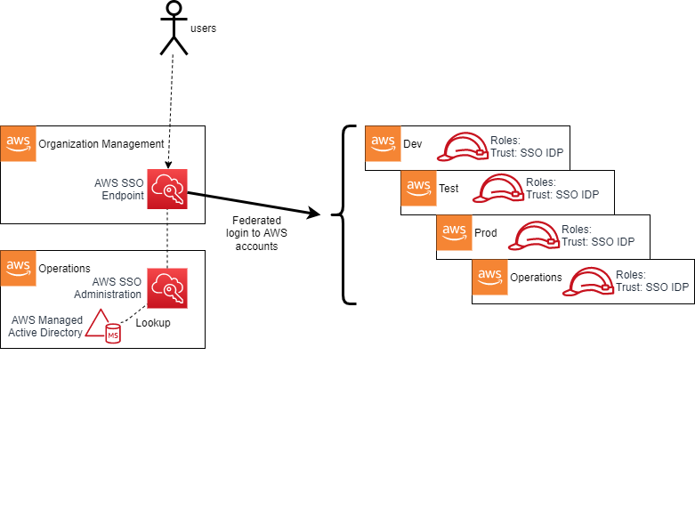

AWS IdC then authenticates the user based on the connected Managed Microsoft AD installation (in the Operations account) or other connected IdP provider. Based on group membership defined in the IdP, the user will be presented with a set of roles to assume into assigned accounts. For example, a developer user may be placed into groups that permit Administrative access in a specific developer account and Read-Only access in a test account; meanwhile a Cloud Operations Administrator may have high-privilege access to most, or all, accounts. In effect, AWS IdC adds SAML IdP capabilities to the AWS Managed Microsoft AD, with the AWS Console acting as a service-provider (SP) in SAML parlance. Other SAML-aware SPs may also be used with AWS IdC.

### 4.5.1. IdC User Roles

When enabled and an identity provider (IdP) is associated with AWS Identity Center (IdC), the identity provider (IdP) and groups created within the IdP are automatically associated with each account in the organization. The IAM roles used by end users have a trust policy to this IdP. When a user authenticates to AWS IdC and selects a role to assume based on their group membership, the IdC service provides the user with temporary security credentials unique to the role session. In such a scenario, the user has no long-term credentials (e.g. password, or access keys) and instead uses their temporary security credentials. 

Users, via their AD group membership, are ultimately assigned to SSO user roles via the use of AWS SSO permission sets. A permission set is an assignment of a particular permission policy to an AWS account. For example:

An organization might decide to use **AWS Managed Policies for Job Functions** that are located within the IdC service as the baseline for role-based-access-control (RBAC) separation within an AWS account. This enables job function policies such as:

- **Administrator** - This policy provides full access to all AWS services and resources in the account;
- **Power User** - Provides full access to AWS services and resources, but does not allow management of users, groups and policies;
- **Database Administrator** - Grants full access permissions to AWS services and actions required to set up and configure AWS database services;
- **View-Only User** - This policy grants permissions to view resources and basic metadata across all AWS services. It does not provide access to get or read workload data.

### 4.5.2. Principal Authorization

Having assumed a role, a user’s permission level within an AWS account with respect to any API operation is governed by the IAM policy evaluation logic flow ([detailed here][iam_flow]):

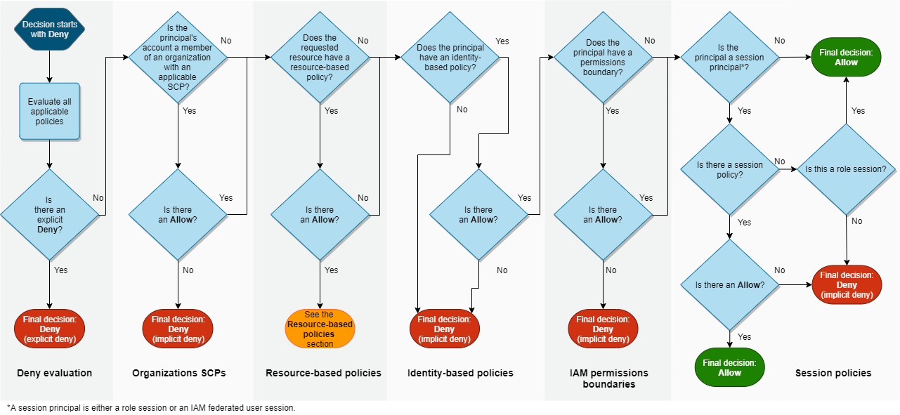

Having an `allow` to a particular API operation on the role (i.e. session policy) does not necessarily imply that API operation will succeed. As depicted above, a **deny** at any level in the evaluation logic will block access to the API call; for example a restrictive permission boundary or an explicit `deny` at the resource or SCP level will block the call. SCPs are used extensively as a guardrailing mechanism in the _Trusted Secure Enclaves Sensitive Edition Architecture_, and are discussed in a later section.

## 4.6. Root Authorization

Every AWS account has a set of root credentials. These root credentials are generated on account creation with a random 64-character password. As part of the installation documentation we recommend to enable [Central root access for member accounts](https://docs.aws.amazon.com/IAM/latest/UserGuide/id_root-enable-root-access.html) and remove the root credentials from all member accounts. It is important that the root credentials for the **management** account be recovered and MFA enabled via the AWS root credential password reset process using the account’s unique email address. To further protect these credentials, the Trusted Secure Enclaves Sensitive Edition Architecture specifically denies the use of the root user via SCP. Root credentials authorize all actions for all AWS services and for all resources in the account (except anything denied by SCPs). There are some actions which only root has the capability to perform which are found within the [AWS documentation](https://docs.aws.amazon.com/general/latest/gr/aws_tasks-that-require-root.html). These are typically rare operations (e.g. creation of X.509 keys), and should not be required in the normal course of business. The central root access management feature allow you to [perform some root user tasks](https://docs.aws.amazon.com/IAM/latest/UserGuide/id_root-user-privileged-task.html) on member accounts using short-term root access. Those actions are allowed by the SCPs provided by this architecture.

In the very rare case where you need to login using root long term credentials in a member account you will need to follow these instructions:

1. Disable/remove the **"ROOT"** SCP statement that applies to the target account. This is needed because the policy only allows actions using the short term root credentials
2. [Take a privileged action](https://docs.aws.amazon.com/IAM/latest/UserGuide/id_root-user-privileged-task.html) on the account to **Allow password recovery**
3. [Recover the password for the root user](https://docs.aws.amazon.com/IAM/latest/UserGuide/reset-root-password.html)
4. Login to the account using the root user and execute the operation you need
5. [Take a privileged action](https://docs.aws.amazon.com/IAM/latest/UserGuide/id_root-user-privileged-task.html) on the account to **Delete root credentials**
6. Restore the original **"ROOT"** SCP statement

Root credentials should be handled with extreme diligence, with MFA enabled per the guidance in the previous section for the management account and root credentials being removed from all member accounts.

## 4.7. Service Roles

A service role is an IAM role that a service assumes to perform actions in an account on the user’s behalf. When a user sets up an AWS service, the user must define an IAM role for the service to assume. This service role must include all the permissions that are required for the service to access the AWS resources that it needs. Service roles provide access only within a single account and cannot be used to grant access to services in other accounts. Users with appropriate IAM permissions can create, modify, and delete a service role from within the IAM service. For example, an authorized user can create a role that allows Amazon Redshift to access an Amazon S3 bucket on the user’s behalf and then load data from that bucket into an Amazon Redshift cluster. In the case of IdC, during the process in which AWS IdC is enabled, the AWS Organizations service grants AWS IdC the necessary permissions to create subsequent IAM roles.

## 4.8. Service Control Policies

Service Control Policies are a key preventative control used by the _Trusted Secure Enclaves Sensitive Edition Architecture_. It is crucial to note that SCPs, by themselves, never _grant_ permissions. They are most often used to `Deny` certain actions at an OU, or account level within an AWS Organization. Since `deny` always overrides `allow` in the IAM policy evaluation logic, SCPs can have a powerful effect on all principals in any account, and can wholesale deny entire categories of actions irrespective of the permission policy attached to the principal itself - even the root user of the account.

SCPs follow an inheritance pattern from all levels of the hierarchy down to the account of the organization:

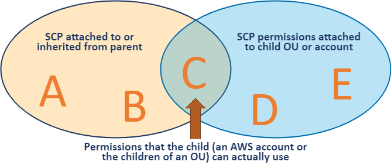

In order for any principal to be able to perform an action A, it is necessary (but not sufficient) that there is an `Allow` on action A from all levels of the hierarchy down to the account, and no explicit `Deny` anywhere. This is discussed in further detail in [How SCPs Work][scps].

The _Trusted Secure Enclaves Sensitive Edition_ leverages the following SCPs in the organization:

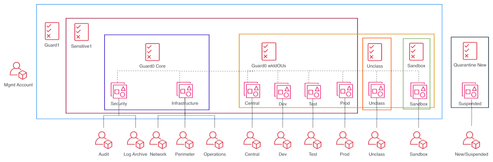

### 4.8.1. Guardrail Protection (Parts 0 and 1)

These guardrails apply across the organization and protect the infrastructure deployed by the automation tooling. These guardrails are split across two files due to SCP size constraints, but logically should be considered a single policy.

Guardrail1
| Policy Statement ID (SID) | Description                                                                                                                                                                    |
| ------------------------- | ------------------------------------------------------------------------------------------------------------------------------------------------------------------------------ |
| `ALM`                     | Prevents deletion and modification of protected cloudwatch alarms which alert on significant control plane events                                                              |
| `CFN`                     | Prevents creation, deletion or modification of any CloudFormation stacks deployed by the automation tooling                                                                    |
| `LAM`                     | Prevents the creation, deletion and modification of any Lambda functions deployed by the automation tooling                                                                    |
| `LOG`                     | Prevents the deletion and modification of any CloudWatch Log groups and VPC flow logs                                                                                          |
| `LOG2`                    | Additional CloudWatch Log group protections                                                                                                                                    |
| `NET1`                    | Prevents deletion of any protected networking (VPC) constructs like subnets and route tables                                                                                   |
| `NFW`                     | Prevents destructive operations on protected AWS Network Firewalls                                                                                                             |
| `ROL`                     | Prevents any IAM operation on protected IAM resources                                                                                                                          |
| `S3`                      | Prevents deletion and modification of any S3 bucket used by the automation tooling incl. centralized logs                                                                      |
| `SSM`                     | Prevents creation, deletion or modification of any SSM resource deployed by the automation tooling                                                                             |
| `TAG1`                    | Prevents creation, deletion and modification of a protected security group                                                                                                     |
| `TAG2`                    | Prevents creation, deletion and modification and use of any protected IAM resource                                                                                             |

Guardrail0 WKLD

| Policy Statement ID (SID) | Description                                                                                                                                                                    |
| ------------------------- | ------------------------------------------------------------------------------------------------------------------------------------------------------------------------------ |
| `ACM`                     | Prevents deletion of a protected certificates and Load Balancers                                                                                                               |
| `CON`                     | Protects AWS Config configuration from modification or deletion                                                                                                                |
| `CT`                      | Prevents deletion and modification of protected Cloud Trails                                                                                                                   |
| `CWE`                     | Prevents deletion and modification of protected CloudWatch events                                                                                                              |
| `Deny`                    | Protects deletion and modification of protected KMS keys                                                                                                                       |
| `IAM`                     | Protects creation, deletion, and modification of protected IAM policies                                                                                                        |
| `RUL`                     | Protects AWS Config rules from modification or deletion                                                                                                                        |
| `SEC`                     | Prevents the deletion and modification to AWS security services like GuardDuty, Security Hub, Macie, Firewall Manager, Access Analyzer, password policies, and resource shares |

Guardrail0 Core
| Policy Statement ID (SID) | Description                                                                                                                                                                    |
| ------------------------- | ------------------------------------------------------------------------------------------------------------------------------------------------------------------------------ |
| `KIN`                     | Prevents creation, deletion and modification of a protected Kinesis streams                                                                                                    |
| `SNS`                     | Prevents creation, deletion and modification of a protected SNS topics                                                                                                         |

Note: Two versions of the Part-0 policy exist (CoreOUs and WkldOUs), with the Wkld OUs version of the policy removing SNS, and KIN sections as they are not relevant outside the Security and Infrastructure OUs.

### 4.8.2. Sensitive policy

This is a comprehensive policy whose main goal is to provide a compliant cloud environment for sensitive workloads, namely prohibiting any non-centralized networking, data-at-rest encryption and mandating data residency in the home region. This policy is attached to all top-level OUs with the exception of Unclassified and Sandbox.

| Policy Statement ID (SID) | Description                                                                                                                                                                                                             |
| ------------------------- | ----------------------------------------------------------------------------------------------------------------------------------------------------------------------------------------------------------------------- |
| `AUR`                     | Prevents the creation of an unencrypted RDS Aurora cluster                                                                                                                                                              |
| `EBS1`                    | Prevents starting EC2 instances without volume level encryption                                                                                                                                                         |
| `EBS2`                    | Prevents the creation of an unencrypted EBS volume                                                                                                                                                                      |
| `EFS1`                    | Prevents the creation of an unencrypted EFS volume                                                                                                                                                                      |
| `GBL1`                    | Prevents the use of any service in any non-approved AWS region with the exception of services that are considered global; e.g. CloudFront, IAM, STS, etc.                                                               |
| `GBL2`                    | Within services that are exempted from GBL1, scope the use of those services to the us-east-1 region (ACM, KMS, SNS)                                                                                                    |
| `NET2`                    | Prevents the creation of any networking infrastructure such as VPCs, gateways, peering, VPN, etc. Additionally blocks making objects public (RDS, EMR, EC2, etc.) and the creation of IAM users, groups and access keys |
| `OTHS`                    | Blocks miscellaneous operations and services including Leave Organization, Modify Payment Methods, Object Sharing, Disabling SSO, and Lightsail, Sumerian, Gamelift, AppFlow, and IQ.                                   |
| `PMP`                     | Prevents the modification or creation of AWS Private Marketplace                                                                                                                                                        |
| `RDS`                     | Prevents the creation of an unencrypted RDS instance                                                                                                                                                                    |
| `ROOT`                    | Prevents the use of the root user                                                                                                                                                                                       |

#### 4.8.2.1. Encryption at Rest

Note that the Encryption SCP statements above, taken together, mandate encryption at rest for block storage volumes used in EC2, EFS and database instances.

### 4.8.3. Unclassified policy

This policy is only used on the Unclassified OU. This policy is broadly similar to Sensitive; however it relaxes the requirement for non-approved region usage to include additional approved regions. The `GLBL2` services are moved into the `GLBL1` policy.

### 4.8.4. Sandbox policy

This policy is only used on the Sandbox OU and is only appropriate for accounts in which AWS service experimentation is taking place. This policy is broadly similar to Unclassified; however it does not prohibit network infrastructure creation (e.g. VPCs, IGWs), dropping the `NET2` section.

### 4.8.5. Quarantine New Object policy

This policy is attached to an account to ‘quarantine’ it - to prevent any AWS operation from taking place. This is useful in the case of an account with credentials which are believed to have been compromised. This policy is also applied to new accounts upon creation. After the installation of guardrails, it is removed. In the meantime, it prevents all AWS control plane operations except by principals required to deploy guardrails.

| Policy Statement ID (SID)                 | Description                                                                      |
| ----------------------------------------- | -------------------------------------------------------------------------------- |
| `DenyAllAWSServicesExceptBreakglassRoles` | Blanket denial on all AWS control plane operations for all non-break-glass roles |

# 5. Logging and Monitoring

## 5.1. Overview

The _Trusted Secure Enclaves Sensitive Edition Architecture_ takes advantage of the following security services deployed across the organization. These services, taken together, provide a comprehensive picture of the security posture of the organization.

The following diagram depicts the overall TSE-SE logging and monitoring architecture:

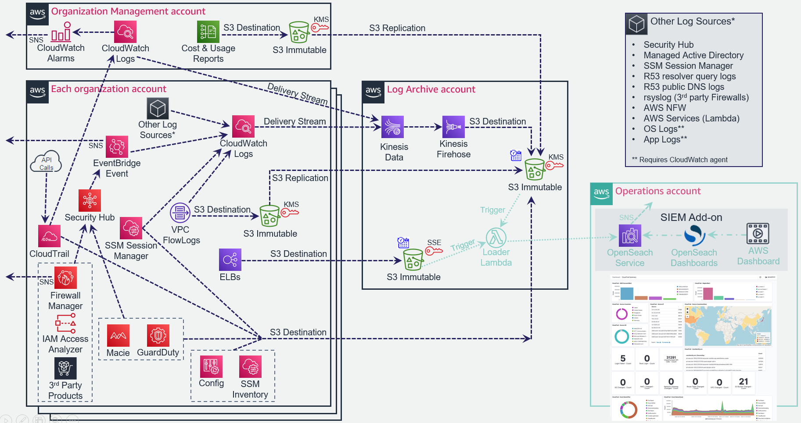

## 5.2. CloudTrail

The AWS CloudTrail service provides a comprehensive log of control plane and data plane operations (audit history) of all actions taken against most AWS services, including users logging into accounts. A CloudTrail Organizational trail is enabled in the organization. For each account, this captures management events and S3 data plane events taking place by every principal in every account in the organization. These records are sent to both a CloudWatch log group in the Organization Management account and an S3 bucket in the Log Archive account.  As this is an Organization trail, the trail itself cannot be modified or deleted by any principal in any child account. This provides an audit trail for detective purposes in the event of the need for forensic analysis into account usage. The logs themselves provide an integrity guarantee: every hour, CloudTrail produces a digest of that hour’s log files, with a hash, and signs it with its own private key. This makes it computationally infeasible to modify, delete or forge CloudTrail log files without detection. This process is [detailed here][ct-digest]. The Log Archive bucket is protected with SCPs, is encrypted and has versioning enabled ensuring deleted or overwritten files are retained.

## 5.3. VPC Flow Logs

VPC Flow Logs capture information about the IP traffic going to and from network interfaces within an AWS Account VPC such as source and destination IPs, protocol, ports, and success/failure of the flow. The _Trusted Secure Enclaves Sensitive Edition Architecture_ enables ALL (i.e. both accepted and rejected traffic) logs for all VPCs in all accounts in both a local CloudWatch log group and an S3 bucket in the log-archive account. It is important to use custom flow log formats to ensure all fields are captured as important fields are not part of the basic format. More details about VPC Flow Logs are [available here][flow].

It should be noted that certain categories of network flows are not captured, including traffic to and from the instance metadata service (`169.254.169.254`), and DNS traffic with an Amazon VPC resolver (available in DNS resolver logs).

## 5.4. GuardDuty

Amazon GuardDuty is a cloud native threat detection and Intrusion Detection Service (IDS) that continuously monitors for malicious activity and unauthorized behavior to protect your AWS accounts and workloads. The service uses machine learning, anomaly detection, and integrated threat intelligence to identify and prioritize potential threats. GuardDuty uses a number of data sources including VPC Flow Logs, DNS logs, CloudTrail logs and several threat feeds.

The _Trusted Secure Enclaves Sensitive Edition Architecture_ requires GuardDuty be enabled [at the Organization level][gd-org], and delegates the Security account as the GuardDuty Administrative account. The GuardDuty Administrative account is auto-enabled to add new accounts as they come online. This is be done in every region as a defense in depth measure, with the understanding that the SCPs will prevent service usage in all other regions.

## 5.5. Config

[AWS Config][config] provides a detailed view of the resources associated with each account in the AWS Organization, including how they are configured, how they are related to one another, and how the configurations have changed on a recurring basis. Resources can be evaluated on the basis of their compliance with Config Rules - for example, a Config Rule might continually examine EBS volumes and check that they are encrypted.

Config may be [enabled at the Organization][config-org] level - this provides an overall view of the compliance status of all resources across the organization. The AWS Config multi-account multi-region data aggregation capability has been located in both the Organization Management account and the Security Tooling account.

## 5.6. CloudWatch Logs

CloudWatch Logs is AWS’ log aggregator service, used to monitor, store, and access log files from EC2 instances, AWS CloudTrail, Route 53, and other sources. The _Trusted Secure Enclaves Sensitive Edition Architecture_ requires that log subscriptions are created for all log groups in all workload accounts, and streamed into S3 in the log-archive account (via Kinesis) for analysis and long-term audit purposes. The CloudWatch log group retention period on all log groups should be set to a medium retention period (such as 2 years) to enable easy online access.

### 5.6.1. CloudWatch Logs Friction

CloudWatch Log group deletion is prevented via SCPs for security purposes in this design and bypassing this rule would be a fundamental violation of security best practices. This protection does NOT exist solely to protect TSE-SE logs, but all CloudWatch log groups. Users of the TSE-SE environment will need to ensure they set CloudFormation stack Log group retention type to RETAIN, or stack deletes will fail when attempting to delete a stack (as deleting the log group will be blocked) and users will encounter errors. As repeated stack deployments will be prevented from recreating the same log group name (as it already exists), end users will either need to check for the existence of the log group before attempting creation, or include a random hash in the log group name. The TSE-SE also sets log group retention for all log groups to value(s) specified by customers in the config file and prevents end users from setting or changing Log group retentions. When creating new log groups, end users must either not configure a retention period, or set it to the default NEVER expire or they will also be blocked from creating the CloudWatch Log group. If applied by bypassing the guardrails, customer specified retention periods on log group creation will be overridden with the Accelerator specified retention period.

While a security best practice, some end users request this be changed, but you need to ask: Are end users allowed to go in and clean out logs from Windows Event Viewer (locally or on domain controllers) after testing? Clean out Linux kernel logs? Apache log histories? The fundamental principal is that all and as many logs as possible will be retained for a defined retention period (some longer). In the "old days", logs were hidden deep within OS directory structures or access restricted by IT from developers - now that we make them all centralized, visible, and accessible, end users seem to think they suddenly need to clean them up. Customers need to establish a usable and scalable log group naming standard/convention as the first step in moving past this concern, such that they can always find their active logs easily. As stated, to enable repeated install and removal of stacks during test cycles, end user CloudFormation stacks need to set log groups to RETAIN and leverage a random hash in log group naming (or check for existence, before creating).

The TSE-SE SCPs (guardrails/protections) are our recommendations, yet designed to be fully customizable, enabling any customer to carefully override these defaults to meet their individual requirements. If insistent, we'd suggest only bypassing the policy on the Sandbox OU, and only for log groups that start with a very specific prefix (not all log groups). When a customer wants to use the delete capability, they would need to name their log group with the designated prefix - i.e. opt-in to allow CloudWatch log group deletes.

## 5.7. SecurityHub

The primary dashboard for Operators to assess the security posture of the AWS footprint is the centralized AWS Security Hub service. Security Hub is configured to aggregate findings from enabled services such as Amazon GuardDuty, Amazon Macie, AWS Config, Systems Manager, Firewall Manager, Amazon Detective, Amazon Inspector and IAM Access Analyzers. Events from security integrations are correlated and displayed on the Security Hub dashboard as ‘findings’ with a severity level (informational, low, medium, high, critical).

The Trusted Secure Enclaves Sensitive Edition Architecture recommends that the current 3 Security Hub frameworks be enabled, specifically:

- [AWS Foundational Security Best Practices v1.0.0][found]
- [NIST Special Publication 800-53 Revision 5][nist]
- [CIS AWS Foundations Benchmark v3.0.0][cis]

These frameworks will perform checks against the accounts via Config Rules that are evaluated against the AWS Config resources in scope. See the above links for a definition of the associated controls.

## 5.8. Systems Manager Session Manager and Fleet Manager

[Session Manager](https://docs.aws.amazon.com/systems-manager/latest/userguide/session-manager.html) is a fully managed AWS Systems Manager capability that lets you manage your Amazon Elastic Compute Cloud (Amazon EC2) instances, on-premises instances, and virtual machines (VMs) through an interactive one-click browser-based shell, through the AWS Command Line Interface (AWS CLI), or using a native RDP or SSH client. Session Manager provides secure and auditable instance management without the need to open inbound ports, maintain bastion hosts, or manage SSH keys. Session Manager also makes it easy to comply with corporate policies that require controlled access to instances, strict security practices, and fully auditable logs with instance access details, while still providing end users with simple one-click cross-platform access to your managed instances.  With Session Manager customers can gain quick access to Windows and Linux instances through the AWS console, or using their preferred clients.
Fleet Manager additionally allows connecting graphically to Windows desktops directly from the AWS console without the need for any command line access or tools, and without any requirement for an RDSH/RDP client.

The _Trusted Secure Enclaves Sensitive Edition Architecture_ stores encrypted session log data (Systems Manager Session Manager and/or Fleet Manger) in both CloudWatch logs and in the centralized S3 bucket for auditing purposes.

## 5.9. Systems Manager Inventory

AWS Systems Manager Inventory provides visibility into your AWS computing environment. The TSE-SE architecture uses SSM Inventory to collect metadata from your managed nodes and stores this metadata in the central Log Archive S3 bucket. These logs enable customers to quickly determine which nodes are running the software and configurations required by your software policy, and which nodes need to be updated.

## 5.10. Other Services

The following additional services are configured by the TSE-SE solution with their organization-wide administrative and visibility capabilities centralized to the Security account: Macie, Firewall Manager, Access Analyzer. The following additional logging and reporting services are configured: CloudWatch Alarms, Cost and Usage Reports, rsyslog (optional), Managed AD security logs, R53 logs, ELB (optional).

The [optional rsyslog servers](https://github.com/aws-samples/landing-zone-accelerator-on-aws-for-tse-se/blob/main/reference-artifacts/third-party/fortinet/config/customizations-config.yaml#L104) are included to accept logs for appliances and third party applications that do not natively support the CloudWatch Agent from any account within a customer’s Organization. These logs are immediately forwarded to CloudWatch Logs within the account the rsyslog servers are deployed (Operations) and then copied to the S3 immutable bucket in the log-archive account. Logs are only persisted on the rsyslog hosts for 24 hours. The rsyslog servers are required to centralize any 3rd party firewall logs.

# 6. Networking

The reference architecture has been specifically designed to deliver a prescriptive default network configuration, whilst also offering the flexibility to customize the network to meet the specific requirements of the workloads that will be run within the solution. This section covers both the default configuration, and how the solution has been designed to allow other networking patterns to be implemented.

The reference architecture networking is built on a principle of centralized on-premises and internet ingress/egress, while enforcing data plane isolation between workloads in different environments. Connectivity to on-premises environments, internet egress, shared resources and AWS APIs are mediated at a central point of ingress/egress via the use of a [Transit Gateway][aws_tgw]. Consider the following overall network diagram:

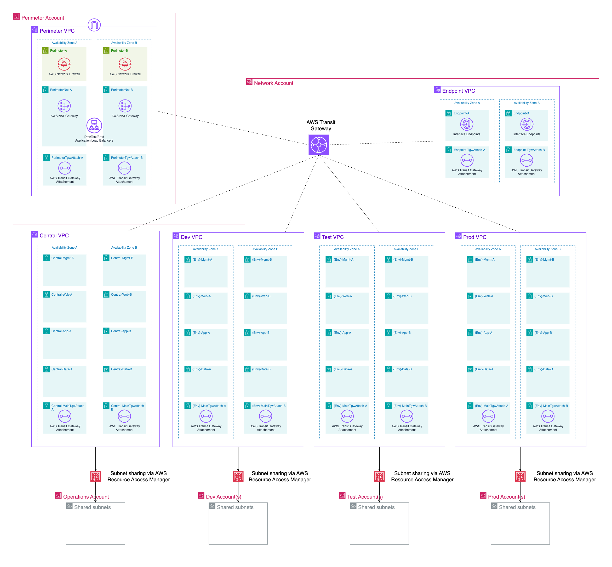

All functional accounts use RAM-shared networking infrastructure as depicted above. The workload VPCs (Dev, Test, Prod, etc) are hosted in the Shared Network account and made available to the appropriate accounts based on their OU in the organization.

## 6.1 IP Address Management

## 6.1.1 IP Address Management Schema

To support this flexible network deployment model, it is critical to consider a well structured IP address management (IPAM) schema, allowing for simple and strong isolation between core services, environments and workloads, whilst also providing the scalability, resilience and flexibility needed by organizations. The reference architecture provides an IP address management design to support these goals. 

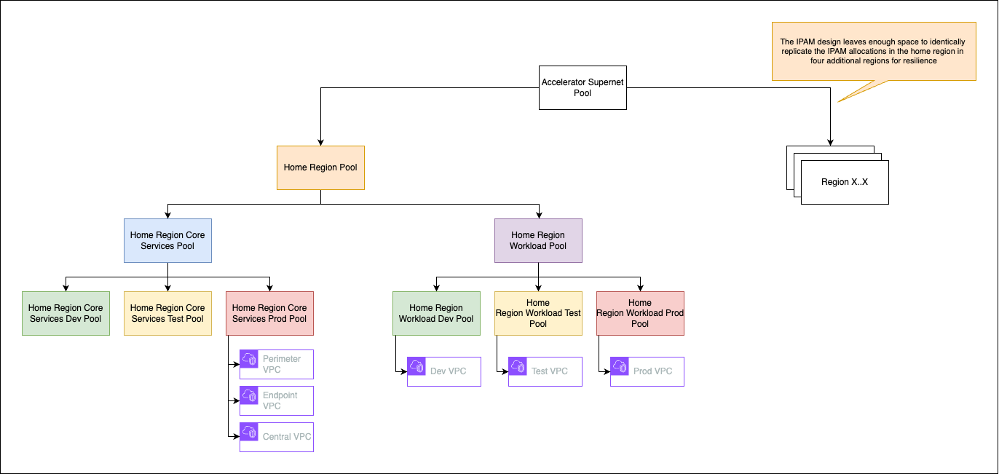

The structure described in the diagram allows teams to:

- support additional regions for disaster recovery and business continuity
- draw a clear distinction between organization wide networks used for landing zone services and those used for workload networks
- allow environments to be easily summarized by CIDR, enabling simple firewall and routing control to enforce isolation

To enforce the structured allocation of CIDR ranges across the reference architecture, the solution makes use of [Amazon VPC IP Address Manager (IPAM)](https://docs.aws.amazon.com/vpc/latest/ipam/what-it-is-ipam.html) to create [pools](https://docs.aws.amazon.com/vpc/latest/ipam/how-it-works-ipam.html) which allow the allocation of non-overlapping CIDR ranges for VPC's. Below are tables that describe the IPAM pools and their purpose. These pools, are defined in the [network-config.yaml.ipam](/config/network-config.yaml.ipam).

## Global Ipam Pools
| Pool name | Purpose |
|---|---|
| {{ AcceleratorPrefix }}-sandbox-pool | The {{ AcceleratorPrefix }} Sandbox Pool is used to track sandbox address allocations for visibility. The allocations in this pool are purposely overlapping, as the sandbox networks are isolated to the local sandbox account they are created for, and never connected to other networks in the accelerator. |
| {{ AcceleratorPrefix }}-supernet | The {{ AcceleratorPrefix }} Supernet Pool defines a contiguous CIDR supernet to be used for all AWS resources across the entire accelerator deployment, except sandbox networks which are purposely isolated. |

## Regional Ipam Pools
| Pool name | Purpose |
|---|---|
| {{ AcceleratorPrefix }}-home-region-pool | The {{ AcceleratorPrefix }} Home Region Pool is used for all CIDR ranges (e.g. core, dev, test, prod etc) used within the home region. The home region pool has spare address space to allow customers to add in additional environments or extend the existing environments. |

##Accelerator Core Services Pools
| Pool name | Purpose |
|---|---|
| {{ AcceleratorPrefix }}-home-region-core-services-pool | The {{ AcceleratorPrefix }} home region core services pool is used for all core services that are established and maintained by the accelerator administrators. For example, the endpoint, perimeter and central VPC's. The home region core services pool has spare address space to allow customers to add in additional environments or extend the existing environments. |
| {{ AcceleratorPrefix }}-home-region-core-services-dev-pool" | The {{ AcceleratorPrefix }} Home Region Core Services Dev Pool is currently unused within the accelerator. However this pool is created to allow the accelerator administrators to build their own Dev networks for the services they wish to provide beyond the default accelerator capabilities. This will allow the administrator of the landing zone to utilise their own SDLC across Dev, Test and Prod for core services. |
| {{ AcceleratorPrefix }}-home-region-core-services-test-pool | The {{ AcceleratorPrefix }} Home Region Core Services Test Pool is currently unused within the accelerator. However this pool is created to allow the accelerator administrators to build their own Test networks for the services they wish to provide beyond the default accelerator capabilities. This will allow the administrator of the landing zone to utilise their own SDLC across Dev, Test and Prod for core services. |
| {{ AcceleratorPrefix }}-home-region-core-services-prod-pool | The {{ AcceleratorPrefix }} Home Region Core Services Prod Pool is used to provide network addresses for shared core services, for example the perimeter, endpoint and central VPCs. |

## Accelerator Workload Pools
| Pool name | Purpose |
|---|---|
| {{ AcceleratorPrefix }}-home-region-workload-pool | The {{ AcceleratorPrefix }} Home Region Workload Pool is used for all workload environments in the home region, e.g. Dev, Test and Production. |
| {{ AcceleratorPrefix }}-home-region-workload-dev-pool | The {{ AcceleratorPrefix }} Home Region Workload Dev Pool is used for all development workload environments in the home region. |
| {{ AcceleratorPrefix }}-home-region-workload-test-pool | The {{ AcceleratorPrefix }} Home Region Workload Test Pool is used for all test workload environments in the home region. |
| {{ AcceleratorPrefix }}-home-region-workload-prod-pool | The {{ AcceleratorPrefix }} Home Region Workload Prod Pool is used for all production workload environments in the home region. ||

The AWS IPAM pools for Dev, Test and Prod for both workload and core services, have been configured to auto-register CIDR ranges from any VPCs that are created in the environment. This enables the solution administrators to have a holistic picture of all VPC CIDR allocations across their environment.

## 6.1.2 IP Address Management CIDR allocation strategies

When thinking about the allocation of CIDR ranges to the IPAM schema defined above there are typically two high level approaches. The decision on which strategy to adopt becomes even more important for customers who wish to a adopt a hub-and-spoke network model to introduce further isolation with any environment e.g. Dev, test, Prod. More information to help understand network designs can be found [here](https://aws.amazon.com/blogs/networking-and-content-delivery/designing-hyperscale-amazon-vpc-networks/).

1. Allocate a large CIDR range, for example a "/8" that does not overlap with on-premises environments
2. Allocate two smaller ranges, for example "/20" that do not overlap with on-premises environments

The architecture that is descried in this design document, recommends the first option, to allocate a large CIDR range, for example a "/8" that does not overlap with on-premises ranges. This leaves customers with the most flexibility allowing them to adopt different network architectures in the future.

However, we understand that for many customers it is not possible to allocate a large non-overlapping range, as it is already consumed across their on-premises estates. In this case, option 2 allows customers to have some portion of the workload subnets remain routable, whilst re-using the second CIDR across workload VPC allocations. When services wish to communicate between each other or with on-premises services, they do so via private NAT Gateways and load balancers that exist within the workloads routable subnets. However, this approach brings with it some trade-offs that need to be understood. Further details on adopting this model can be seen [here](/documentation/alternative-ipam-patterns.md).

For customers that adopt the recommended approach to allocate a large non-overlapping range, see the example below of how the CIDR can carved up across the IPAM schema.

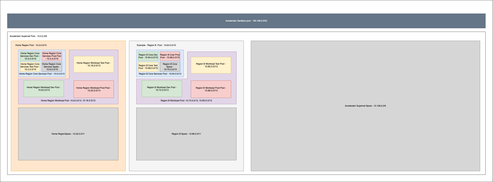

When customers are deciding on the size of address space to allocate, we recommend doing forecasting to understand the scale of the solution. How many teams will be on-boarded, what size networks do they need for their workloads, how many accounts will each team have per team/project etc? With this information it is possible to forecast the amount of CIDR space required across the solution when it is allocated, and make sure the platforms CIDR range is large to support it.

## 6.2. Perimeter

The perimeter VPC hosts the organization's perimeter security services. The Perimeter VPC is used to control the flow of traffic between AWS Accounts and the public (internet). This VPC hosts AWS Network Firewall (or optionally 3rd party Next Generation Firewalls (NGFW)) that provide perimeter security services including virus scanning / malware protection, Intrusion Protection services, TLS Inspection and Web Application Firewall protection.

Note that this VPC is in its own isolated account, separate from Shared Network, in order to facilitate networking and security 'separation of duties'. Internal networking teams may administer the cloud networks in Shared Network account without being granted permission to administer the security perimeter itself.

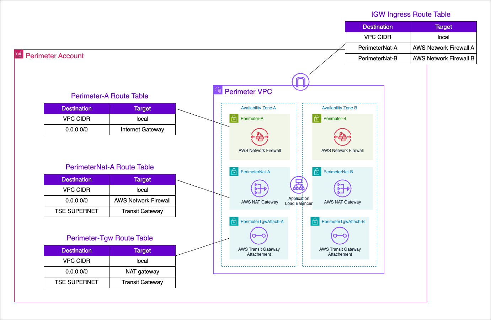

## 6.3. Shared Network

The Shared Network account, and the AWS networking resources therein, form the core of the cloud networking infrastructure across the account structure. Rather than the individual accounts defining their own networks, these are instead centralized here and shared out to the relevant OUs. Principals in a Dev OU will have access to a Dev VPC, Test OU will have access to a Test VPC and so on - all of which are owned by this account.

The reference architecture shares the necessary network resources; AWS Transit Gateways, Subnets, AWS License Manager configurations, and Amazon Route 53 Resolver rules resources with AWS Resource Access Manager (RAM). The RAM service eliminates the need to create duplicate resources in multiple accounts, reducing the operational overhead of managing those resources in every single account.

### 6.3.1. Transit Gateway

The Transit Gateway is a central hub that performs several core functions within the Shared Network account.

1. Routing of permitted flows; for example a Workload to internet via the Perimeter VPC.
   - All routing tables in Shared Network VPCs send `0.0.0.0/0` traffic to the TGW, where its handling will be determined by the TGW Route Table (TGW-RT) that its attachment is associated with. For example:
     - an HTTP request to `registry.hub.docker.com` from the Test VPC will go to the TGW
     - The Segregated TGW RT will direct that traffic to the Perimeter VPC
     - The request will be directed to the internet via the NAT Gateway
     - The response traffic from the NAT Gateway will arrive at the Core TGW RT, where a propagation in that TGW RT will direct the response back to the Test VPC.

The following diagram shows the egress flows from workload accounts to the internet via the perimeter account.


The following diagram shows the ingress flows from the internet to workload accounts via the perimeter account.


2. Defining separate routing domains that prohibit undesired east-west flows at the network level; for example, by prohibiting Dev to Prod traffic. For example:
   - For example, if Dev traffic destined for the Prod VPC the traffic will be blocked by the blackhole route in the Segregated TGW RT.


3. Enabling centralization of shared resources; namely a shared Microsoft AD installation in the Central VPC, and access to shared VPC Endpoints in the Endpoint VPC.
   - The Central VPC, and the Endpoint VPC are routable from Workload VPCs. This provides an economical way to share organization-wide resources that are nonetheless isolated into their own VPCs. For example:
     - a `git` request in the `Dev` VPC to `git.private-domain.ca` resolves to a private IP address in the `Central` VPC.
     - The request from the `Dev` VPC will go to the TGW due to the VPC routing table associated with that subnet
     - The TGW will send the request to the `Central` VPC via an entry in the Segregated TGW RT
     - The `git` response will go to the TGW due to the VPC routing table associated with that subnet
     - The Shared TGW RT will direct the response back to the `Dev` VPC

  

The four TGW RTs exist to serve the following main functions:

- **Segregated TGW RT**: Used as the association table for the workload VPCs; prevents east-west traffic, except to shared resources.
- **Core TGW RT**: Used for internet/on-premises response traffic, and Endpoint VPC egress.
- **Shared TGW RT**: Used to provide `Central` VPC access east-west for the purposes of response traffic to shared workloads
- **Standalone TGW RT**: Reserved for future use. Prevents TGW routing except to the Endpoint VPC.

Note that a unique BGP ASN will need to be used for the TGW. The default value in the reference architecture is `65521`.

### 6.3.2. Endpoint VPC

The endpoint VPC hosts VPC Interface Endpoints (VPCEs) using [AWS PrivateLink endpoints](https://docs.aws.amazon.com/vpc/latest/privatelink/what-is-privatelink.html) and associated Route 53 private hosted zones for all applicable services in the designated home region. This permits traffic destined for an eligible AWS services; for example SQS, KMS, CloudWatch etc, to remain entirely within the Shared Network account rather than transiting via the IPv4 public endpoint for the service. Centralizing the endpoints helps reduce the costs associated with deploying endpoints within every VPC in the network.

### 6.3.3. Endpoint VPC: DNS

To enable the workload networks to return the private [RFC1918] address for AWS services rather than the public addresses, a DNS zone and records are created on the Endpoint VPC for each AWS service which is configured for access via PrivateLink. These zones are then associated with each of the VPCs created in the Shared Network account (e.g. Dev, Test, Prod, Central). From within any account using one of these VPCs, such as `Dev`, the service endpoint (e.g. `sqs.ca-central-1.amazonaws.com`) will resolve to the PrivateLink IP in the `Endpoint` VPC instead of the public IP:

```bash
sh-4.2$ nslookup sqs.ca-central-1.amazonaws.com
Server:         10.2.0.2                  # Dev VPC's .2 resolver.
Address:        10.2.0.2#53

Non-authoritative answer:
Name:   sqs.ca-central-1.amazonaws.com
Address: 10.7.1.190                       # IP in Endpoint VPC - AZ-a.
Name:   sqs.ca-central-1.amazonaws.com
Address: 10.7.0.135                       # IP in Endpoint VPC - AZ-b.
```

The following diagram shows the DNS configuration described above.


### 6.3.4. Endpoint VPC: Hybrid DNS

The Endpoint VPC also hosts the common DNS infrastructure used to resolve DNS queries:

- within the cloud
- from the cloud to on-premises
- from on-premises to the cloud

#### 6.3.4.1. Within The Cloud

In-cloud DNS resolution applies beyond the DNS infrastructure that is put in place to support the Interface Endpoints for the AWS services in-region. Other DNS zones, associated with the Endpoint VPC, are resolvable the same way via an association to workload VPCs.

#### 6.3.4.2. From Cloud to On-Premises

DNS Resolution from the cloud to on-premises is handled via the use of a Route 53 Outbound Endpoint, deployed in the Endpoint VPC, with an associated Resolver rule that forwards DNS traffic to the outbound endpoint. Each VPC is associated to this rule.


#### 6.3.4.3. From On-Premises to Cloud

Conditional forwarding from on-premises networks is made possible via the use of a Route 53 Inbound Endpoint. On-premises networks send resolution requests for relevant domains to the endpoints deployed in the Endpoint VPC:


### 6.3.5. Workload VPCs

The workload VPCs are where line of business applications ultimately reside, segmented by environment (`Dev`, `Test`, `Prod`, etc). It is recommended that the Workload VPC use a [RFC1918][1918] range (e.g. `10.2.0.0/16` for `Dev`, `10.3.0.0/16` for `Test`, etc).


Note that security groups are recommended as the primary data-plane isolation mechanism between applications that may coexist in the same VPC. It is anticipated that unrelated applications would coexist in their respective tiers without ever permitting east-west traffic flows.

The following subnets are defined by the _Trusted Secure Enclaves Sensitive Edition Architecture_:

- **TGW subnet**: This subnet hosts the elastic-network interfaces for the TGW attachment. A `/27` subnet is sufficient.
- **Web subnet**: This subnet hosts front-end or otherwise 'client' facing infrastructure. A `/20` or larger subnet is recommended to facilitate auto-scaling.
- **App subnet**: This subnet hosts app-tier code (EC2, containers, etc). A `/19` or larger subnet is recommended to facilitate auto-scaling.
- **Data subnet**: This subnet hosts data-tier code (RDS instances, ElastiCache instances). A `/21` or larger subnet is recommended.
- **Mgmt subnet**: This subnet hosts bastion or other management instances. A `/21` or larger subnet is recommended.

Each subnet is associated with a Common VPC Route Table, as depicted above. Gateway Endpoints for relevant services (Amazon S3, Amazon DynamoDB) are installed in the Common route tables of all Workload VPCs. Aside from local traffic or gateway-bound traffic, `0.0.0.0/0` is always destined for the TGW.

The following diagram gives examples of how security groups and NACL's control traffic between resources that are deployed into the shared VPC's.


#### 6.3.5.1. Security Groups

Security Groups are instance level stateful firewalls, and represent a foundational unit of network segmentation across AWS networking. Security groups are stateful, and support ingress/egress rules based on protocols and source/destinations. While CIDR ranges are supported by the latter, it is preferable to instead use other security groups as sources/destinations. This permits a higher level of expressiveness that is not coupled to particular CIDR choices and works well with autoscaling; e.g.

> "permit port 3306 traffic from the `App` tier to the `Data` tier"

versus

> "permit port 3306 traffic from `10.0.1.0/24` to `10.0.2.0/24`.

Security group egress rules are often used in 'allow all' mode (`0.0.0.0/0`), with the focus primarily being on consistently allow listing required ingress traffic. This ensures day to day activities like patching, access to Windows DNS, and to directory services can function without friction. The provided sample security groups in the workload accounts offers a good balance that considers both security, ease of operations, and frictionless development. They allow developers to focus on developing, enabling them to simply use the pre-created security constructs for their workloads, and avoid the creation of wide-open security groups. Developers can equally choose to create more appropriate least-privilege security groups more suitable for their application, if they are skilled in this area. It is expected as an application is promoted through the SDLC cycle from Dev through Test to Prod, these security groups will be further refined by the extended customer teams to further reduce privilege, as appropriate. It is expected that each customer will review and tailor their Security Groups based on their own security requirements.

#### 6.3.5.2. NACLs

Network Access-Control Lists (NACLs) are stateless constructs used sparingly as a defense-in-depth measure in this architecture. AWS generally discourages the use of NACLs given the added complexity and management burden, given the availability and ease of use provided by security groups. Each network flow often requires four NACL entries (egress from ephemeral, ingress to destination, egress from destination, ingress to ephemeral). The architecture recommends NACLs as a segmentation mechanism for `Data` subnets; i.e. `deny` all inbound traffic to such a subnet except that which originates in the `App` subnet for the same VPC. As with security groups, we encourage customers to review and tailor their NACLs based on their own security requirements.

### 6.3.6. Central VPC

The Central VPC is a network for localizing operational infrastructure that may be needed across the organization, such as code repositories, artifact repositories, and notably, the managed Directory Service (Microsoft AD). Instances that are domain joined will connect to this AD domain - a network flow that is made possible from anywhere in the network structure due to the inclusion of the Central VPC in all relevant association TGW RTs.

#### 6.3.6.1. Domain Joining

An EC2 instance deployed in the Workload VPCs can join the domain corresponding to the Microsoft AD in `Central` provided the following conditions are all true:

1. The instance needs a network path to the Central VPC (given by the Segregated TGW RT), and appropriate security group assignment;
2. The Microsoft AD should be 'shared' with the account the EC2 instance resides in (The _Trusted Secure Enclaves Sensitive Edition Architecture_ recommends these directories are shared to workload accounts);
3. The instance has the AWS managed policies `AmazonSSMManagedInstanceCore` and `AmazonSSMDirectoryServiceAccess` attached to its IAM role, or runs under a role with at least the permission policies given by the combination of these two managed policies; and
4. The EC2's VPC has an associated resolver rule that directs DNS queries for the AD domain to the Central VPC.

### 6.3.7. Sandbox VPC

A sandbox VPC, not depicted, may be included in the _Trusted Secure Enclaves Sensitive Edition Architecture_. This is **not** connected to the Transit Gateway, Perimeter VPC, on-premises network, or other common infrastructure. It contains its own Internet Gateway, and is an entirely separate VPC with respect to the rest of the _Trusted Secure Enclaves Sensitive Edition Architecture_.

The sandbox VPC should be used exclusively for time-limited experimentation, particularly with out-of-region services, and never used for any line of business workload or data.

## 6.4. Hybrid Connectivity and Inspection

### 6.4.1. Connecting on-premises networks/datacenters to AWS tenancy

It is recommended that customers create a new AWS sub-account in your organization in the Infrastructure OU to “own” the Direct Connect (DX), segregating Direct Connect management and billing from other organization activities. Once provisioned customers need to create a Public VIF on the DX in this account. You can also create additional Private VIF’s when and if required, and share them directly with any sub-account that needs to consume them.

Customers then inter-connect directly to the Transit Gateway, in the Shared Network sub-account, from there on-premises network/datacenters.

**MACSEC:**

This is the preferred mechanism to implement in-transit encryption between a customers on-premises network and there AWS cloud tenancy. MACSEC provides a secure, scalable, highly available, and easy to manage encryption solution. This guidance will be updated once MACSEC is broadly available across AWS transit centers.

**VPN / TGW Connect Method:**

- Initiate IPSec VPN tunnels from on-premises to the TGW using BGP w/ECMP to scale and balance the traffic. Equal Cost Multi-Pathing (ECMP) is used to balance the traffic across the available VPN tunnels
- You need to create as many VPN attachments to the TGW as is required to meet your bandwidth requirements or DX capacity. Today IPSec attachments are limited to 1.25 Gbps each (10 Gbps would require 8 attachments) and is scalable to 50 Gbps. TGW Connect attachments are limited to 5 Gbps each with a maximum of 4 GRE tunnels per attachment
- Each VPN attachment would comprise two tunnels (active/passive), each connecting to a different on-premises firewall/VPN appliance
- The VPN attachments would then be connected to an appropriately configured route table on the TGW

TGW route tables provide VRF like segregation capabilities, allowing customers to control which of their cloud based networks are allowed to communicate on-premises, or visa-versa.

This architecture is fully managed and easy to manage, highly available, scalable, cost effective, and enables customers to reserve all their 3rd party Perimeter firewall capacity for public or internet facing traffic.

The following diagram gives and overview of the optional VPN configuration.

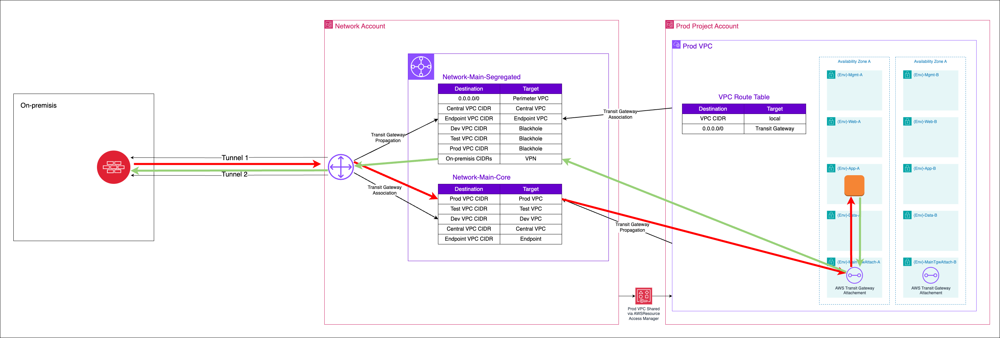

#### 6.4.1.1 Does this configuration violate typical zoning principals?

Data center interconnects are not typically considered zoning boundaries (or ZIPs). Additionally, in many cases the on-premises VPN termination device used to interconnect to the cloud either contains, or is placed in-line with firewall and/or inspection devices. Customers insistent on placing a firewall between datacenters can enable the appropriate filtering or inspection on these on-premise devices. Enabling the same capabilities inside AWS would mean a customer is inspecting both ends of the same wire, and is discouraged.

It should be noted that workloads in all AWS accounts are fully protected using AWS Security Groups (stateful firewalls) wrapped around each and every instance comprising a workload.

#### 6.4.1.2. Why NOT use a VGW on the perimeter VPC?

The VGW solution was not designed to support an enterprise cloud environment – it was designed to provide single VPC connectivity. The VGW solution offers lower availability than other options as it relies on VPC route tables to steer traffic, which need to be updated using custom scripts in the event the failure of an appliance or availability zone. The VGW solution is typically harder to maintain and troubleshoot. The VGW solution has limited scalability, as the VGW only supports a single active connection and does not support BGP or ECMP (i.e. supports a maximum bandwidth of 1.25Gbps). This approach is highly discouraged, many customers needing enterprise cloud connectivity have switch away from this approach.

#### 6.4.1.3. Why NOT connect directly to a 3rd party firewall cluster in the perimeter account?

This approach was common with AWS customers before the TGW was introduced, with many customers upgrading or considering upgrading to the TGW approach. We also have some customers using this architecture based on a very specific limitation of the customer’s Direct Connect architecture, these customers typically also want to migrate to the TGW approach, if they could.

While viable, this approach adds unneeded complexity, reduces cloud availability, is expensive to scale, and reduces bandwidth to internet facing workloads. This solution doubles the IPSec VPN tunnels using BGP w/ECMP requirements as it needs tunnels on both sides of the firewall. In this configuration each firewall appliance typically only provides a single pair of IPSec connections supporting marginally more bandwidth than the TGW VPN attachments. Adding tunnels and bandwidth requires adding firewall appliances. Stateful capabilities typically need to be disabled due to performance and asymmetric routing challenges. This typically means a very expensive device is being deployed inside AWS simply to terminate a VPN tunnel.

#### 6.4.1.4. What if I want to inspect this traffic inside AWS, yet like the TGW architecture?

Customers who insist on inspecting the ground to cloud traffic inside AWS _can_ do this with the proposed TGW architecture. The TGW route tables can be adjusted to hairpin the traffic through either a dedicated Inspection VPC, or to the Perimeter account firewall cluster for inspection. The Inspection VPC option could leverage 3rd party firewalls in an autoscaling group behind a Gateway Load Balancer, or leverage AWS network firewall to inspection traffic. To maximize internet throughput, the Inspection VPC option is generally recommended.

### 6.4.2. Workload account IaaS flow pattern

The perimeter (ingress/egress) account typically contains two ALB's, one for production workloads and another for Dev/Test workloads. The Dev/Test ALB should be locked to restrict access to on-premises users (using a security group) or have authentication enabled to prevent Dev/Test workloads from being exposed to the internet. Additionally, each workload account (Dev/Test/Prod) contains a local (back-end) ALB.

AWS Web Application Firewall (WAF) should be enabled on both front-end and back-end ALB's. The Front-end WAF would contain rate limiting, scaling and generic rules. The back-end WAF would contain workload specific rules (i.e. SQL injection). As WAF is essentially a temporary fix for broken applications before a developer can fix the issue, these rules typically require the close involvement of the application team. Rules can be centrally managed across all WAF instances using AWS Firewall Manager from the Security account.

The front-end ALB is then configured to target the back-end ALB using an add-on Lambda to update and maintain the perimeter ALB with the IP of the back-end ALB. This enables configuring different DNS names and/or paths to different back-end ALB's. NAT to DNS mechanism built into 3rd party appliances could be utilized but are often found to be too complex, not work with bump-in-the-wire inspection devices (NFW, GWLB), and only available on a limited number of 3rd party firewalls.

This implementation allows workload owners to have complete control of workloads in a local account including the ELB configuration, and allow site names and paths to be defined and setup at sub-account creation time (instead of during development) to enable publishing publicly or on-premises in a rapid agile manner. The reference architecture provides automation to enable the platform administrators to easily configure ALB listeners in the perimeter account to the ALB deployed in the workload account. 

### 6.4.3. CloudFront and API Gateway flow patterns

The perimeter account is focused on protecting legacy IaaS based workloads. Cloud Native applications including CloudFront and API Gateway should be provisioned directly in the same account as the workload and should NOT traverse the perimeter account.

These services must still be appropriately configured. This includes ensuring both WAF and logging are enabled on each endpoint.

[sensitive]: https://www.canada.ca/en/government/system/digital-government/modern-emerging-technologies/cloud-services/government-canada-security-control-profile-cloud-based-it-services.html#toc4
[aws_org]: https://aws.amazon.com/organizations/
[aws_scps]: https://docs.aws.amazon.com/organizations/latest/userguide/orgs_manage_policies_type-auth.html#orgs_manage_policies_scp
[aws_vpn]: https://docs.aws.amazon.com/vpn/latest/s2svpn/VPC_VPN.html
[aws_dc]: https://aws.amazon.com/directconnect/
[aws_vpc]: https://aws.amazon.com/vpc/
[aws_tgw]: https://aws.amazon.com/transit-gateway/
[aws_r53]: https://aws.amazon.com/route53/
[ssm_endpoints]: https://aws.amazon.com/premiumsupport/knowledge-center/ec2-systems-manager-vpc-endpoints/
[1918]: https://tools.ietf.org/html/rfc1918
[6598]: https://tools.ietf.org/html/rfc6598
[ebs-encryption]: https://docs.aws.amazon.com/AWSEC2/latest/UserGuide/EBSEncryption.html#encryption-by-default
[s3-block]: https://docs.aws.amazon.com/AmazonS3/latest/dev/access-control-block-public-access.html#access-control-block-public-access-options
[root]: https://docs.aws.amazon.com/general/latest/gr/aws_tasks-that-require-root.html
[iam_flow]: https://docs.aws.amazon.com/IAM/latest/UserGuide/reference_policies_evaluation-logic.html
[scps]: https://docs.aws.amazon.com/organizations/latest/userguide/orgs_manage_policies_scps-about.html
[pbmm]: https://www.canada.ca/en/government/system/digital-government/modern-emerging-technologies/cloud-services/government-canada-security-control-profile-cloud-based-it-services.html#toc4
[accel_tool]: https://github.com/awslabs/landing-zone-accelerator-on-aws
[ct-digest]: https://docs.aws.amazon.com/awscloudtrail/latest/userguide/cloudtrail-log-file-validation-intro.html
[flow]: https://docs.aws.amazon.com/vpc/latest/userguide/flow-logs.html
[gd-org]: https://docs.aws.amazon.com/guardduty/latest/ug/guardduty_organizations.html
[config]: https://docs.aws.amazon.com/config/latest/developerguide/WhatIsConfig.html
[config-org]: https://docs.aws.amazon.com/organizations/latest/userguide/services-that-can-integrate-config.html
[found]: https://docs.aws.amazon.com/securityhub/latest/userguide/fsbp-standard.html
[nist]: https://docs.aws.amazon.com/securityhub/latest/userguide/nist-standard.html
[cis]: https://docs.aws.amazon.com/securityhub/latest/userguide/cis-aws-foundations-benchmark.html
[ssm]: https://docs.aws.amazon.com/systems-manager/latest/userguide/session-manager.html

---

**Continue to [LZA installation instructions](../install.md)**