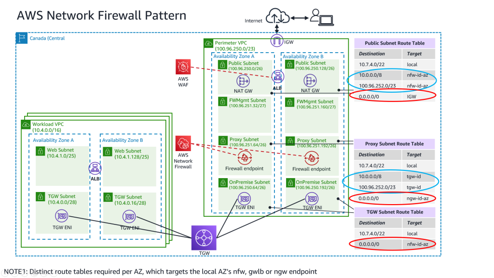
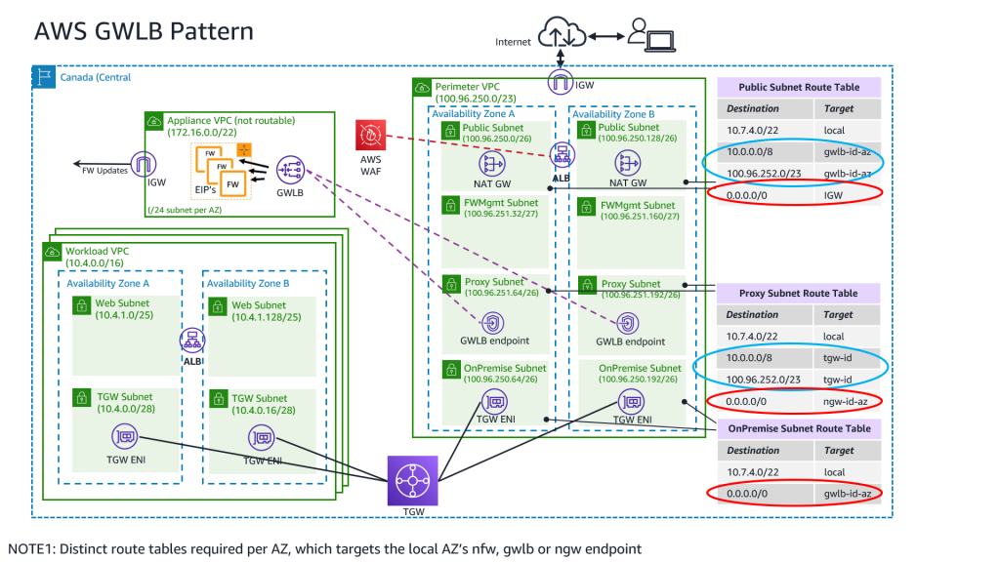
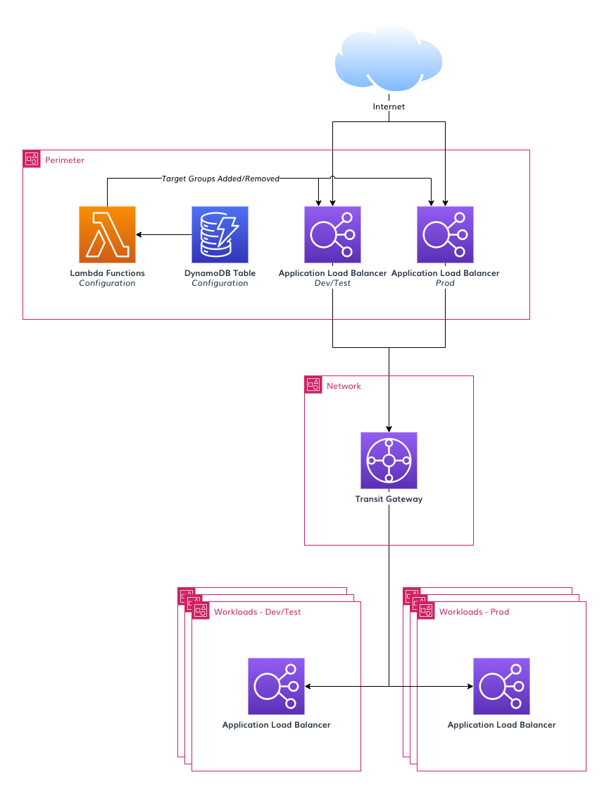

# TSE-SE Reference Architecture — sensitive-workload design on the LZA Universal Config baseline

## 1. What this document is

The _Trusted Secure Enclaves — Sensitive Edition (TSE-SE)_ is a multi-account AWS reference architecture for national security, defence, law-enforcement, government, and regulated customers who run sensitive, protected, or sovereign workloads. It aligns with [NIST SP 800-53](https://www.nist.gov/privacy-framework/nist-sp-800-53), [ITSG-33](https://www.cyber.gc.ca/en/guidance/it-security-risk-management-lifecycle-approach-itsg-33), [CCCS-Medium](https://www.cyber.gc.ca/en/guidance/guidance-security-categorization-cloud-based-services-itsp50103), [FedRAMP Moderate](https://www.fedramp.gov/understanding-baselines-and-impact-levels/), [IRAP](https://www.cyber.gov.au/irap), and other sensitive/medium-level profiles.

The [LZA Universal Configuration](https://github.com/aws/lza-universal-configuration/blob/main/docs/01-Overview/index.adoc) (UC) is the secure baseline you start from.

These customers plan for a capable, persistent adversary; for data whose residency and key custody are set by law; and for controls that must stand up as evidence to an accreditor. This document sets out how these customers reason about that risk, and the control and network-design choices the reasoning produces on the UC baseline.

It does not re-describe the baseline. UC's account structure, guardrails, logging, and networking mechanics are documented by the UC project, and this document links to that documentation. It covers three things:

- **How sensitive workloads raise the bar** (section 3) — the risk lenses that drive everything below.
- **The control posture** (section 6) — the hardening each lens produces.
- **Segmentation and perimeter design** (section 7) — the network decisions a sensitive threat model drives.

This document is the reasoning. For the exact file and property behind each control, go to the [uplift guide](../uplift-to-tse-se/README.md); the two are written to be read together.

## 2. Design principles

The TSE-SE reference architecture is built on these principles:

1. Deliver security outcomes aligned with a medium/sensitive-level control profile (for example CCCS-Medium, NIST SP 800-53 Moderate, or FedRAMP Moderate).
2. Operate as least privilege: every principal runs with the lowest feasible permission set.
3. Segment aggressively: strong isolation between SDLC stages, between administrative functions, and between workloads.
4. Centralise what benefits from central control — identity, logging, network ingress/egress, and security tooling — so it can be governed and audited in one place.
5. Encrypt everything at rest and in transit, with the customer holding the keys where the workload's sensitivity demands it.
6. Enforce data residency and sovereignty where the compliance regime requires it.
7. Keep the full pace of AWS innovation available to workload teams within these guardrails.

## 3. How sensitive workloads raise the bar

A general-purpose landing zone is designed for the common case: accidental misconfiguration, opportunistic attackers, mainstream compliance. Five risk lenses separate a TSE-SE build from that baseline, and every control and network decision below traces back to one of them.

- **Assume a capable adversary is already present.** Design for containment and forensic reconstruction, not prevention alone. If a workload account is compromised, what can the adversary reach, and what record survives to reconstruct the event? This drives strong segmentation, near-real-time detection, immutable logging, and deep traffic inspection.
- **Sovereignty is a legal obligation.** Where data resides and who can decrypt it are set by law and treaty. Residency has to be enforced and provable; keys have to be held and revocable by the customer rather than the platform.
- **Controls must be demonstrable to an accreditor.** A control enforced from a reviewed, version-controlled artifact is evidence an assessor can sign off; the same control set from a console is a claim you then have to substantiate. Sensitive builds prefer controls that live in the config repository.
- **Blast radius is measured against an intruder already inside.** Isolation between environments and workloads is designed to slow an intruder's lateral movement, a harder problem than accidental cross-talk.
- **Detection and response run on short timelines.** A SOC facing a capable adversary needs signal in minutes, and enough telemetry breadth and retention to reconstruct what happened long after.

## 4. Start from the UC baseline

Deploy UC first. Everything below assumes a UC deployment is in place; its prerequisites, config modules, and deployment steps are in the [UC Getting Started guide](https://github.com/aws/lza-universal-configuration/blob/main/docs/02-Getting-Started/index.adoc).

Two UC characteristics affect the design below:

- **UC is built on AWS Control Tower.** Control Tower provisions accounts through Account Factory, sets the cross-account execution role to `AWSControlTowerExecution`, enrols accounts and regions, and owns the organization CloudTrail. Some baseline controls therefore live in Control Tower settings rather than the config repository. **Region control** is the clearest case — UC delivers it through the [Control Tower Region Deny control](https://github.com/aws/lza-universal-configuration/blob/main/docs/03-Management-Governance/index.adoc#regional-deny-control), a Control Tower-managed SCP set from the console or landing-zone manifest. The policy is visible in AWS Organizations and retrievable with `controltower get-landing-zone`, so it is auditable; section 6 covers why a sovereign build also states it in the config repository.
- **UC ships two network models** — hub-and-spoke and shared VPC — covered in [section 7](#7-networking--segmentation-and-perimeter-design-for-a-sensitive-threat-model).

## 5. Account and organizational structure

UC's organizational structure is documented in the UC [Management and Governance guide](https://github.com/aws/lza-universal-configuration/blob/main/docs/03-Management-Governance/index.adoc). In brief, UC creates:

- **Security OU** — `LogArchive` and the `Audit` account (the delegated administrator for GuardDuty, Security Hub, Macie, Config, and IAM Access Analyzer).
- **Infrastructure OU** — `Network`, `SharedServices` (the delegated administrator for IAM Identity Center), and `Perimeter` accounts.
- **Workloads OU** — a parent OU with nested `Sandbox`, `Dev`, `Test`, and `Prod` OUs for the application lifecycle, referenced as `Workloads/Dev`, `Workloads/Test`, and so on in the [uplift guide](../uplift-to-tse-se/README.md).
- **Suspended OU** — a `DenyAll` containment zone for decommissioned or quarantined accounts.
- **LzaDeployment OU and account** — present only for container-based deployments in partitions such as the AWS European Sovereign Cloud; standard CodePipeline deployments do not use it.

Shared organizational tooling — directory services, code and artifact repositories, patch and operational tooling — lives in the `SharedServices` account and, on the network side, the Shared Services VPC.

### Structure decisions for a sensitive environment

- **An unclassified/experimentation OU.** For the narrow case where you must give console access to unvetted users, test services not yet approved for sensitive data, or use services absent from your sovereign regions, add an optional `UnClass` OU at the top level with a relaxed region posture. Keep sensitive workloads out of it.
- **Hardware-MFA break-glass and root discipline.** Restrict the Management account to a handful of high-trust principals; keep 2–4 hardware-MFA break-glass IAM users there; enable [central root access management](https://docs.aws.amazon.com/IAM/latest/UserGuide/id_root-enable-root-access.html) and remove standing root credentials from member accounts; require phishing-resistant MFA for all users. UC's `guardrails-2` SCP already denies root use and blocks IAM user creation outside break-glass; a sensitive build adds hardware MFA on break-glass and root as an operational control on top.

## 6. The control posture for sensitive workloads

Each control below is grouped by the risk it addresses, and links to the uplift guide for the exact change.

### 6.1 What the UC baseline already delivers

The UC baseline delivers controls that sensitive environments require. Take them as they stand:

- **A data and identity perimeter (RCPs).** UC attaches a Resource Control Policy that denies external principals from writing to or reading your S3, SQS, Secrets Manager, and KMS resources, blocks non-TLS requests, protects LZA-managed KMS keys, guards the log-archive bucket, and closes confused-deputy paths. It is an organization-wide guardrail on *your resources*, complementing the SCPs that constrain *your principals*.
- **Declarative VPC Block Public Access.** A bidirectional block on internet-gateway traffic, applied as an account-wide declarative policy that a workload team cannot undo per-VPC.
- **A least-privilege IAM permission boundary.** UC ships a boundary policy that denies IAM and Organizations mutation, protects control-plane roles, and enforces its own attachment.
- **Macie finding hygiene.** Macie runs across the organization with `publishSensitiveDataFindings: false`, so the sensitive content it discovers is not re-exposed in the Security Hub console; policy findings still publish.
- **DNS Firewall, Transit Gateway flow logs, and long log-bucket retention.** Baseline detective and network-visibility controls that sensitive builds would otherwise add by hand.

### 6.2 Hardening for a sensitive threat model

These controls uplift the baseline for a sensitive threat model. Each buys more assurance for more cost, friction, or overhead, so each is a judgement call for your threat model. The [uplift guide](../uplift-to-tse-se/README.md) has the exact edit for each.

#### Sovereign key custody (customer-managed keys)

Provision per-account customer-managed KMS keys for S3, Lambda, SQS, and CloudWatch Logs so the key policy is yours. This counters anyone who can reach the data at rest without your involvement, like the platform operator or a foreign legal demand: holding the key and being able to revoke it is what separates "encrypted" from "encrypted under a key you control", where an AWS-managed key leaves that control with the platform. It adds key-management effort, since every key, region, and rotation is yours to run and a mis-scoped policy can lock a service out of its own data. You can rely on the baseline's default encryption if your data classification puts neither the operator nor cross-jurisdiction access in scope. → [how to apply](../uplift-to-tse-se/README.md#per-account-customer-managed-kms-keys-cmks)

#### Data residency stated in config

Carry the region boundary as a customer-managed SCP in the repository, alongside the Control Tower Region Deny control. The `GBL1` statement denies action outside your home region bar a global-service allow-list, and `GBL2` scopes `acm`/`kms`/`sns:Publish`. Residency for a sovereign workload is a legal boundary, and an accreditor has to see it enforced from an artifact they can review, not only from a console setting. Running both mechanisms means keeping them in step, and both draw on the same Control Tower SCP quota. Control Tower Region Deny on its own is enough where your accreditor accepts it and you do not need the boundary reviewable as code. → [how to apply](../uplift-to-tse-se/README.md#in-configuration-data-residency-enforcement)

#### Near-real-time threat detection

Export GuardDuty findings every fifteen minutes. Detection latency is dwell time: the baseline six-hour export is six hours an adversary can operate before a finding surfaces. Frequent export raises finding volume and cost, and helps only if a SOC is watching to act on what arrives, so match the frequency to your response capability. Without someone to act in minutes, a fifteen-minute window offers no advantage over six hours. → [how to apply](../uplift-to-tse-se/README.md#near-real-time-threat-detection)

#### Tripwires on first-move actions

Alarm on the moves that open an account compromise: root use, sign-in without MFA, and changes to IAM, CloudTrail, Config, and network controls. These fire on the action itself, catching an intruder disabling logging or loosening a control as it happens rather than after a later resource scan. CIS AWS Foundations Benchmark v3.0.0 removed these log-metric-filter controls, so enabling CIS v3 in Security Hub does not provide them; you add them explicitly against the Control Tower trail log group. Maintaining them costs per-filter tuning, and thresholds set too loose train responders to ignore the alarms; the case to skip is narrow, mainly where a SIEM already correlates these events. → [how to apply](../uplift-to-tse-se/README.md#cis-monitoring-alarms)

#### A smaller, encrypted-by-construction service surface

Deny launching unencrypted EBS at create, and block services that sidestep enterprise controls (Marketplace, Lightsail, GameLift, AppFlow, IQ) and account closure. Enforcing encryption at create leaves no window for an unencrypted volume to exist in, and denying the services removes them as an avenue for an adversary or an unwitting user. The cost is builder friction, since legitimate use of a blocked service now needs an exception, and the deny statements draw on the shared Control Tower SCP quota. Leave a service unblocked where your teams need it, and rely on the baseline default-encryption setting where its guarantee matches your risk appetite. → [how to apply](../uplift-to-tse-se/README.md#additional-scp-hardening)

#### Automatic remediation

Auto-correct the misconfigurations most worth closing fast, such as unencrypted or non-HTTPS S3 and IMDSv1, rather than only flagging them. The value is the interval this removes: the window an exposed bucket or a credential-leaking metadata endpoint stays usable between appearing and being fixed. Automation acts without review, so a bad rule or an edge-case resource can be "corrected" in a way that breaks a workload, which is why many teams keep a human in the loop. Detect-and-ticket through Security Hub is the right choice where your change control requires review before anything is altered. → [how to apply](../uplift-to-tse-se/README.md#active-auto-remediation)

#### Forensic-grade logging

Keep more telemetry than day-to-day operations needs, held longer and in more than one place: Session Manager sessions logged to both CloudWatch and S3, 731-day CloudWatch retention, hourly resource-level Cost and Usage reports, organization-wide SSM inventory, SCP-tamper alerting, account-level log capture, and stricter password lockout. Reconstructing an incident can happen long after it occurred, and a single log path is a single point of tampering or loss. The extra telemetry and retention cost storage, and a second session-log sink roughly doubles that store. The baseline's single path and shorter windows are enough for a short-lived environment with no long-tail investigation obligation. → [how to apply](../uplift-to-tse-se/README.md#longer-retention-and-finer-cost-and-audit-granularity)

## 7. Networking — segmentation and perimeter design for a sensitive threat model

UC's networking mechanics — Transit Gateway, IPAM, the core infrastructure VPCs, Network Firewall, DNS Firewall — are documented in the UC [Networking Architecture guide](https://github.com/aws/lza-universal-configuration/blob/main/docs/05-Networking/index.adoc). This section is about the design decisions a sensitive threat model drives, not the mechanics.

A sensitive network design turns on three decisions:

1. **Environment segmentation** — how you stop Dev reaching Prod, and one team's account reaching another's.
2. **North-south inspection** — how internet-bound and inbound traffic is filtered, and by what.
3. **Microsegmentation** — how you constrain traffic *inside* an environment, between tiers and instances.

A sensitive build answers all three against an adversary assumed to be already inside the network.

### 7.1 How the models segment

**[UC Hub-and-Spoke](https://github.com/aws/lza-universal-configuration/blob/main/docs/05-Networking/index.adoc#hub-and-spoke-architecture-default) (default).** Each workload account gets its own VPC from an OU-targeted template, with its own Transit Gateway attachment. Environments are isolated at the account and VPC boundary. East-west and north-south traffic routes through a central Inspection VPC where AWS Network Firewall applies stateful, Suricata-compatible rules. Segmentation is enforced by firewall policy and routing: you allow specific VPC-to-VPC flows deliberately, deny the rest, and every allowed flow is inspected.

**[UC Shared VPC](https://github.com/aws/lza-universal-configuration/blob/main/docs/05-Networking/index.adoc#shared-vpc-architecture-optional) (optional).** Three central VPCs (`shared-dev`, `shared-test`, `shared-prod`) live in the Network account, with subnets shared into workload accounts by RAM. Environments are separated by VPC; intra-VPC isolation rests on security groups and NACLs. It is the most IP-efficient model and keeps network control with a central team.

**A centralised routing-segmented model.** A central network account hosts per-environment VPCs shared by RAM, with Transit Gateway route tables giving VRF-like separation and a blackhole route between environments; internet ingress/egress runs through a dedicated Perimeter account. Segmentation is primarily a routing property: environments cannot reach each other because no route exists. This is the classic sensitive-enclave pattern, and a valid choice where you want routing-level separation with a dedicated perimeter.

For an adversary already inside, Hub-and-Spoke goes further: per-account VPC isolation plus firewall inspection of east-west traffic. A blackhole stops a route but sees nothing; the Inspection VPC both controls and records the flows you permit, which is what forensic reconstruction and lateral-movement detection depend on.

### 7.2 Microsegmentation

Microsegmentation — a stateful security group around every instance, and NACLs as a defence-in-depth control on data subnets — applies in all three models, independent of the segmentation choice above. It is a primary control in the TSE-SE design: prefer security-group-to-security-group rules over CIDR rules ("allow 3306 from the App SG to the Data SG," not from a subnet range), keep egress deliberate, and deny inbound to data subnets except from the app tier. This is the control that contains an adversary who has already taken one instance.

The Hub-and-Spoke model distributes ownership of security groups and NACLs to the workload account teams. That shifts responsibility rather than weakening security: teams gain autonomy, and you add governance — SCP guardrails, Config rules, or automation — to hold the microsegmentation posture consistent across accounts. Decide who owns and audits security-group and NACL policy before choosing Hub-and-Spoke for sensitive workloads.

### 7.3 The trade-offs

| | UC Hub-and-Spoke (default) | UC Shared VPC | Centralised routing-segmented |
|---|---|---|---|
| Environment segmentation | Per-account VPC + firewall policy | Per-VPC; central control | TGW route tables + inter-env blackhole |
| East-west inspection | All workload-to-workload traffic crosses the TGW and is inspected by Network Firewall (each workload has its own VPC) | Only *inter*-VPC traffic is inspected by Network Firewall; traffic *within* a shared VPC routes locally, bypasses the TGW and firewall, and relies on security groups and NACLs | Routing separation; limited inspection |
| Microsegmentation ownership | Distributed to account teams | Central network team | Central, with SG templates |
| Blast radius | Smallest (account-isolated VPCs) | Shared VPC infrastructure | Central network account |
| IP efficiency | Lower (more VPCs, more attachments) | Highest | Moderate |
| Operating model | DevOps / autonomous teams | Centralised network team | Centralised network team |

### 7.4 Perimeter design: from centralised inspection to deep inspection

UC gives you centralised north-south control. The Ingress, Egress, and Inspection VPCs route all internet-bound and inbound traffic through AWS Network Firewall, and DNS Firewall filters outbound resolution against managed threat lists. For many sensitive workloads that is sufficient.

Some workloads need more at the perimeter, driven by the threat model rather than by default:

- **TLS inspection and application-layer control** beyond what Network Firewall provides.
- **A specific accredited appliance** an authorising body requires.
- **A controlled publishing path** for internet-facing IaaS workloads, so exposure is decided at account-creation time and mediated through one point.

TSE-SE provides the reference design for each, built on top of the baseline:

- A third-party next-generation firewall cluster (worked [Fortinet example](../reference-artifacts/third-party/fortinet/README.md)) behind a Gateway Load Balancer, for TLS inspection, IPS, and malware scanning.
- The dual-ALB publishing pattern: a front-end ALB in the Perimeter account, a back-end ALB in the workload account, and an IP-forwarding Lambda that keeps them linked. Internet-facing workloads then publish through one controlled point.

Reference diagrams for the pattern:

  
AWS Network Firewall perimeter

  

  
Third-party NGFW behind a Gateway Load Balancer

  

  
Dual-ALB publishing pattern

  

### 7.5 Recommendation

For most sensitive builds, **Hub-and-Spoke with AWS Network Firewall and DNS Firewall** gives the strongest isolation and the east-west visibility a sensitive threat model needs, provided you govern the distributed security-group and NACL ownership. Choose **Shared VPC** when you need centralised network control, run a dedicated network team, or face severe IP constraints. Add a **third-party NGFW perimeter** where your threat model calls for TLS inspection or a specific accredited appliance, using the TSE-SE reference design.

UC's own [decision guidance for choosing a network model](https://github.com/aws/lza-universal-configuration/blob/main/docs/05-Networking/index.adoc#selecting-the-right-network-architecture) is a good starting point. Confirm the model and any perimeter requirements with your AWS account team as part of accreditation planning.

## 8. Where to go next

- **New to TSE-SE?** [Delivering TSE-SE on the LZA UC baseline](../deliver-on-uc.md)
- **Already running TSE-SE?** [Migrate to the UC baseline](../migrate-to-uc/README.md)
