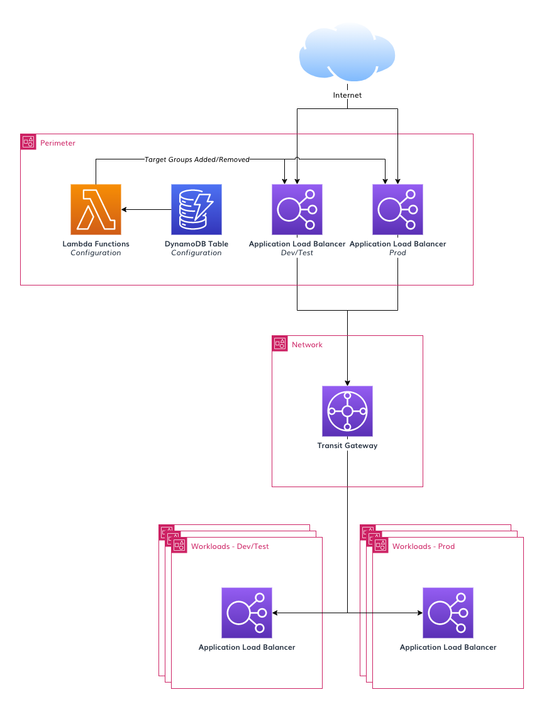

# 4. Post Deployment Steps

## 4.1 Access AWS IAM Identity Centre and configure your identity source

1. Log into the Operations account that is the delegated administration account for AWS IAM Identity Center.
2. If you plan to use the AWS Directory that the reference architecture deploys follow the [IAM Identity centre guidance to configure AD](https://docs.aws.amazon.com/singlesignon/latest/userguide/connectawsad.html). If you plan to use an external IDP follow the [IAM Identity centre guidance to configure an external identity provider](https://docs.aws.amazon.com/singlesignon/latest/userguide/manage-your-identity-source-idp.html).

## 4.2 Configure Multi-factor authentication for IAM Identity Centre:

We recommend the following minimum settings:

- Every time they sign in (always-on)
- Security key and built-in authenticators
- Authenticator apps
- Require them to provide a one-time password sent by email to sign in
- Users can add and manage their own MFA devices

## 4.3 Configure MFA for the breakglass users

The breakglass users are highly privileged user accounts.

Login to the management and follow the [AWS IAM documentation](https://docs.aws.amazon.com/IAM/latest/UserGuide/id_credentials_mfa_enable.html) to configure MFA on both breakglass accounts. We recommend that you use hardware MFA for these accounts.

## 4.4 Configure Application Load Balancer forwarding

Since the `1.7.0-a` release of the configuration, Application Load Balancers are deployed in the Perimeter VPC. Sample configuration is also provided to automate the deployment of Application Load Balancers in workload accounts. AWS ALBs are published using DNS names which resolve to backing IPs which could silently change at any time due to a scaling event, maintenance, or a hardware failure. While published as a DNS name, ALBs can only target IP addresses. This presents a challenge as we need the ALBs in the perimeter account to target ALB's in the various back-end workload accounts.

ALB Forwarding solves this problem by executing a small snippet of code every 60 seconds which updates managed ALB listeners with any IP changes, ensuring any managed flows do not go offline. This removes the requirement to leverage a 3rd party appliance to perform NAT to a DNS name.

## 4.5 Deploy Managed Active Directory configuration instance
When using Managed Active Directory, manual steps are needed to customize the security group created for your domain controllers. By default traffic is only allowed from the CIDR range of the VPC where the directory is deployed. Traffic needs to be allowed from the Endpoint VPC where Amazon Route 53 Outbound Resolver endpoints are deployed as well as all other CIDRs associated to your VPC, other peered VPCs, or networks that you have connected using AWS Direct Connect, AWS Transit Gateway, or Virtual Private Network that need to communicate with the domain controllers.

1. Locate the security group created by Directory Service in your Operations account (named `d-<your-directory-id>_controllers`) and edit the source of the inbound rules to allow traffic from the needed CIDR ranges. You can use the same value used for the `AcceleratorIpamSupernet` replacement variable that covers all your VPC address space. This needs to be customized according to your needs.

Refer to the [AWS Directory Service documentation](https://docs.aws.amazon.com/directoryservice/latest/admin-guide/ms_ad_getting_started.html#ms_ad_getting_started_what_gets_created) for more details.

2. Edit the `iam-config.yaml` file to un-comment and edit as needed the `activeDirectoryConfigurationInstance` block under `managedActiveDirectories`. Send your configuration changes to CodeCommit or S3

3. Release the `AWSAccelerator-Pipeline` to finalize the deployment of the Active Directory configuration instance.

### Architecture Overview



### Deploying ALB Forwarding

The CloudFormation stack to deploy the ALB forwarding is provided in `customizations/AlbIpForwardingStack.template.json`. The configuration to deploy this stack to the Perimeter account is provided in `customizations-config.yaml`. This stack creates a new DynamoDB table named `<AcceleratorPrefix>-Alb-Ip-Forwarding-vpc-*` in the Perimeter account.

### How do I configure an ALB Forwarding Rule?

When using the default configuration file, an external ALB is already provisioned in the Perimeter account with a listener on port 443. For each application that needs to be published, a record needs to be added to the DynamoDB table, see sample below.

Records can be added to the table for any ALB in the account running the ALB Forwarding component (by default, the Perimeter account). Records can be added at any time. DynamoDB change logs will trigger the initial creation of the appropriate target group(s) and IP addresses will be verified and updated every 60 seconds thereafter.

#### Sample JSON to add an entry to the ALB Forwarding table

__Note__: The sample below is in standard JSON format, not DynamoDB JSON. When adding an entry via the console, ensure that __JSON view__ is selected and that __View DynamoDB JSON__ is disabled.

```json
{
    "id": "App1",
    "targetAlbDnsName": "internal-Core-mydevacct1-alb-123456789.ca-central-1.elb.amazonaws.com",
    "targetGroupDestinationPort": 443,
    "targetGroupProtocol": "HTTPS",
    "vpcId": "vpc-0a6f44a80514daaaf",
    "rule": {
        "sourceListenerArn": "arn:aws:elasticloadbalancing:ca-central-1:123456789012:listener/app/Public-DevTest/b1b12e7a0c412bf3/ef9b022a4fdd8bdf",
        "condition": {
            "paths": ["/img/*", "/myApp2"],
            "hosts": ["aws.amazon.com"],
            "priority": 30
        }
    }
}
```

- `id` is any unique text
- `targetAlbDnsName` is the DNS address for the internal ALB for this application (in workload account)
- `vpcId` is the vpc ID containing the external ALB (in perimeter account)
- `sourceListenerArn` is the ARN of the listener of the external ALB (in Perimeter account)
- `paths` and `hosts` are both optional, but one of the two must be supplied
- `priority` must be unique and is used to order the listener rules. Priorities should be spaced at least 40 apart to allow for easy insertion of new applications and forwarder rules.
- the provided `targetAlbDnsName` must resolve to addresses within a [supported](https://docs.aws.amazon.com/elasticloadbalancing/latest/application/load-balancer-target-groups.html) IP address space.

### Troubleshooting ALB forwarding
For tips on troubleshooting issues with ALB forwarding rules see the [FAQ about Application Load Balancers Forwarding](./documentation/FAQ.md#Application-Load-Balancers-Forwarding)
