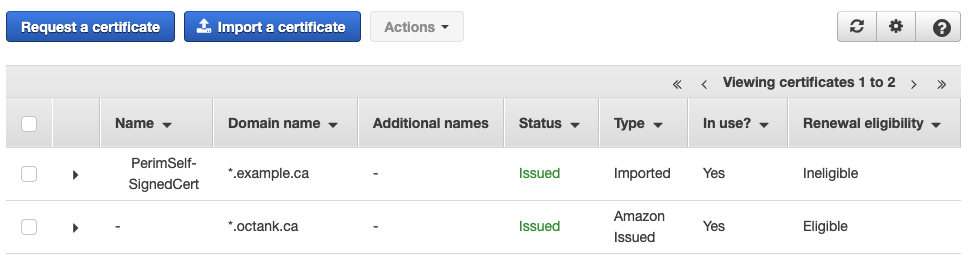
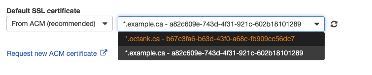
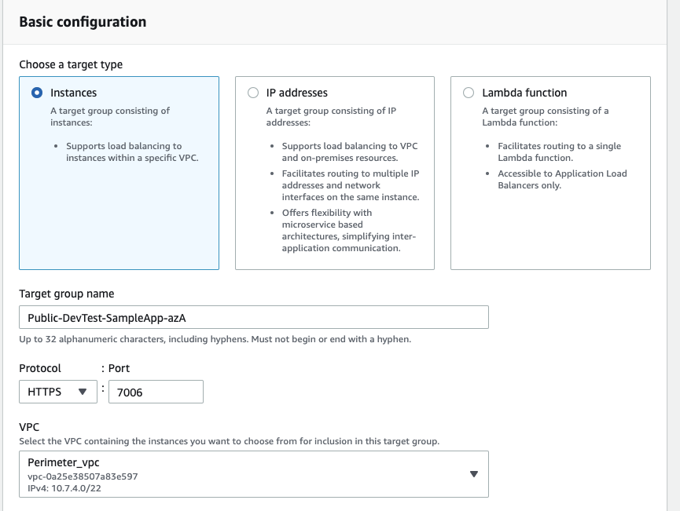
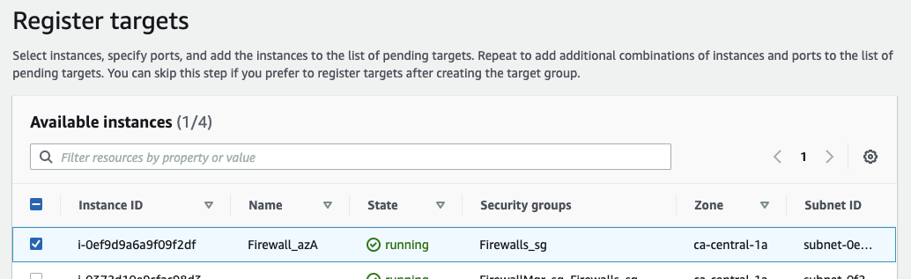
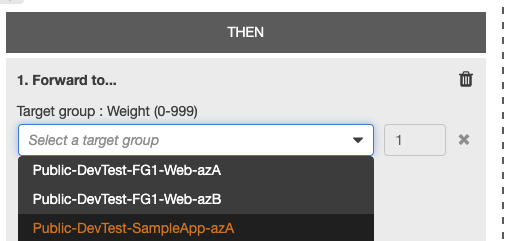

# 1. Public Facing Workload Configuration Sample

## 1.1. Overview

This page describes the steps needed to configure a public facing web application that is deployed within a workload AWS Account in the Landing Zone Accelerator (LZA) with the current reference architecture.

The high-level steps are the following:

1. Create a SSL public certificate in AWS Certificate Manager.
2. Create a DNS entry for the web application.
3. Create Application Load Balancer Target Groups for the web application
4. Create an Application Load Balancer Rule to forward traffic to the Firewalls.
5. Configure the Firewalls.

The screenshots and steps in this page are specific to the FortiGate Firewalls.

## 1.2. Perimeter LZA AWS Account

### 1.2.1. SSL Certificate Configuration

1. Within the Perimeter LZA AWS Account, navigate to the Certificate Manager service.

2. Follow the steps to request a new public certificate. This will be used to support https for the web application. Note that the LZA deploys 'example' certificates, but these should not be used at the perimeter. Here's an example showing a wildcard cert.

3. Navigate to the ALBs and select the Load Balancer that will support the incoming requests for the web application. In this example, it will be the 'Public-DevTest-perimeter-alb'.

4. Select the 'Public-DevTest-perimeter-alb' ALB and click the **View/edit certificates** link button.

5. Click the **+** button and select the new SSL Certificate. Click **Add**.

6. Return back to the ALBs and select the 'Public-DevTest-perimeter-alb' ALB. Select the default HTTPS listener and click **Edit**

7. Change the Default SSL certificate to the newly created public cert and update the settings.

---

### 1.2.2. ALB Target Group Configuration

1. Navigate to the EC2 Load Balancers and view the default Application Load Balancers (ALB).

2. List the ALB Target Groups

These are pairs of targets (one for each firewall) that direct traffic from the perimeter ALB to the firewall. The two pairs were created as part of the default configuration and provide health checks to the shared VPCs. For support a new web application, a new pair will be created. One for each firewall (i.e. one per AZ).

1. Click the **Create target group** button. (Note: This will be repeated for each Firewall).

2. Enter the following parameter values:
    - Target group name: Public-DevTest-SampleApp-azA
    - Protocol: HTTPS
    - Port: (pick an unused port on the Firewall). Example 7006
    - VPC: Perimeter_VPC

5. When Registering a target, pick the instance that aligns with the Availability Zone (AZ) that is being configured. Example: Firewall\*az[A|B]. If creating 'Public-DevTest-SampleApp-**azA**', then choose Firewall instance 'Firewall**\*azA**'.

6. Ensure that the port value is using the previous entered port value. Click the **Include as pending below**.

7. Click the **Create target group** button when ready.

8. Repeat for the additional firewalls.

---

### 1.2.3. ALB Listener Rule Configuration

1. Create a DNS entry for the web application that resolves to the perimeter ALB being configured. For example: webapplication.mydomain.ca resolves to 'Public-DevTest-perimeter-alb-1616856287.ca-central-1.elb.amazonaws.com'

2. Navigate to the ALBs and select the 'Public-DevTest-perimeter-alb' ALB. Click the **View/edit rules** link button.

3. Click the **+** button to create a new rule. Then click the **+ Insert Rule** button.

4. Configure a match condition on **Host header...**. enter the value of the DNS entry for the web application.

5. Click the checkmark to update it.

6. Click the **+ Add action** and select **Forward to...**

7. Configure both Targets using the ones previously created (one per firewall). Adjust for 50% load balanced traffic.

8. Click the checkmark to update and then click the **Save** button.

---

## 1.3. FortiGate Firewall Configuration

The following configuration will be executed per Firewall instance (twice with the default LZA configuration).

1. Log in to the firewall instance.
2. Switch the Virtual Domain (vdom) to **FG-traffic**.

3. Navigate to **Policy & Objects** and select **Addresses**

4. Create a new entry using the following parameter values:

-   Name: Dev1-SampleWebApplication-ALB-FQDN
-   Type: FQDN
-   FQDN: (use the DNS value of the internal load balancer in front of the web application)
-   Interface: tgw-vpn1

5. After saving the entry, refresh the Address grid and verify that the row colour is white and not orange like showed below.

6. Navigate to **Policy & Objects** and select **Virtual IPs**

7. Make note of the used ip address in the Details column. In the example above “10.7.7.181”.

8. Create a New Virtual IP using the following parameter values:

-   Name: Dev1-SampleWebApplication-ALB
-   Interface: public (port1)
-   Type: FQDN
-   External: IP (IP noted above in step 7)
-   Mapped address: Dev1-SampleWebApplication-ALB-FQDN
-   Port Forwarding: Enabled
-   Protocol: TCP
-   Port Mapping Type: One to one
-   External service port: 7006
-   Map to IPv4 port: 443

9. Confirm the Virtual IP shows as a new entry.

10. Navigate to **Policy & Objects** and select **IPv4 Policy** and expand **public (port1)**

11. Locate the desired policy (ex: Dev-Test #8 in the example below). Right-click and click **Edit**.

12. Locate the **Destination** field entry and click the **+** button.

13. Locate the newly created VirtualIP entry (ex: Dev1-SampleWbApplication-ALB) and save the changes. NOTE: The entry is NOT the Address/FQDN entry.

14. After refreshing the page, the row background should be white, and the new destination is visible.

